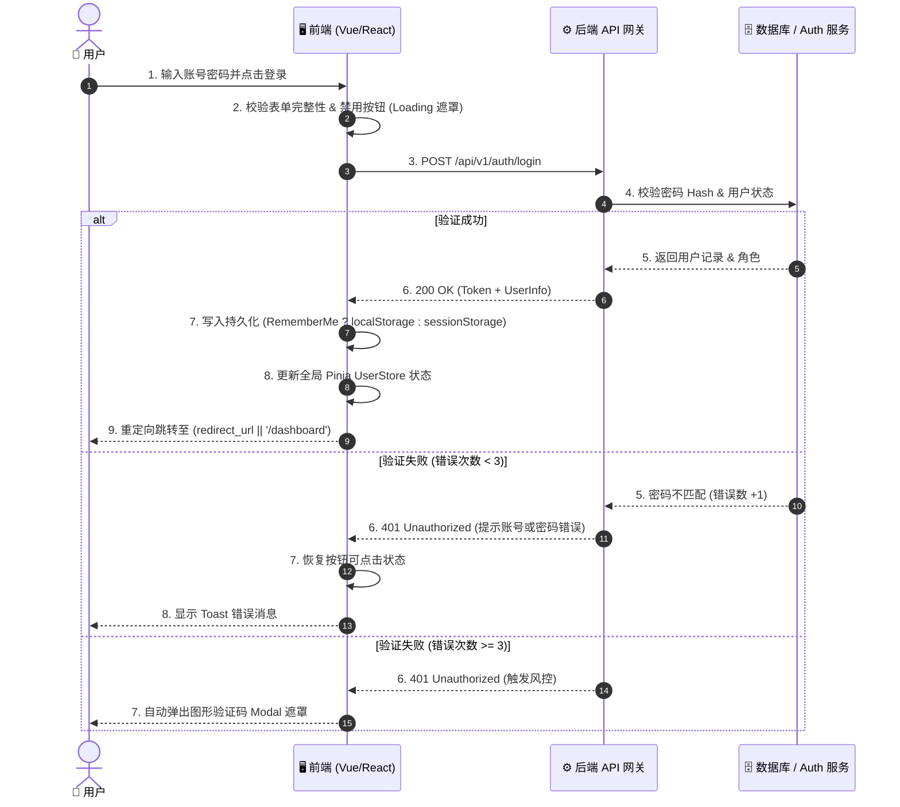

# 💡 Archetype-Architect 标杆范例 (Auth 模块从原型到 PRD 完整示例)

> **范例说明**：本文件为 `archetype-architect` Skill 的理想标杆示范。展示了从输入静态原型 `mockup.html` 经过反向质询（Grill-Me）问答后，自动生成的标准 PRD 文档落盘范例。

---

## 📋 1. 前置质询输入记录 (Input & Grill Audit Log)

- **输入原型路径**：`docs/modules/auth/mockup.html`
- **DOM 解析命令**：`python3 .agents/skills/archetype-architect/scripts/parse_html.py docs/modules/auth/mockup.html`
- **反向质询决策**：
  - **Q1 (Token 存储)**：`1-A`（勾选“记住我”保存在 `localStorage`，未勾选存在 `sessionStorage`）
  - **Q2 (路由跳转)**：`2-B`（优先重定向至 `redirect_url`，若无则跳转至 `/dashboard`）
  - **Q3 (验证码倒计时)**：`3-A`（切换 Tab 时后台保持 60 秒倒计时）
  - **Q4 (防重与风控)**：`4-A`（点击后禁用按钮并显示 Loading 遮罩；连续失败 3 次弹出图形验证码 Modal）

---

## 🔐 2. 最终落盘 PRD 输出示例 (`docs/modules/auth/prd-auth-v1.md`)

# 🔐 业务模块 PRD: 认证与登录模块 (v1.0)

### 📌 1. 模块功能矩阵 (Module Matrix)

| 组件 ID | 元素类型 | 触发动作 | 交互与逻辑说明 | 目标 API / 状态变动 |
| :--- | :--- | :--- | :--- | :--- |
| `btn-login` | `button` | 点击 | 表单校验 ➔ 禁用按钮并显示 Loading 遮罩 ➔ 发起登录请求 ➔ 成功存 Token ➔ 路由跳转 | `POST /api/v1/auth/login` |
| `input-phone` | `input` | 输入 | 手机号正则校验 (`1[3-9]\d{9}`)，实时启用/禁用发送验证码按钮 | 本地 Form State |
| `btn-send-sms`| `button` | 点击 | 触发倒计时 (60s) ➔ 禁用按钮 ➔ 切换 Tab 时后台保持倒计状态 | `POST /api/v1/auth/send-sms` |
| `modal-captcha`| `div` | 自动弹出 | 当密码连续错误 $\ge 3$ 次时触发，完成拼图/图形验证后重置错误计数 | 本地 Modal State |

---

### 🌐 2. 详细 API 契约规范 (API Specifications)

#### 接口 1: `POST /api/v1/auth/login`
- **请求头**: `Content-Type: application/json`
- **请求入参 (Input)**:
  ```json
  {
    "username": "user@example.com",
    "password": "hashed_password_string",
    "rememberMe": true,
    "captchaToken": "optional_captcha_token_if_failed_3_times"
  }
  ```
- **成功响应 (200 OK)**:
  ```json
  {
    "code": 200,
    "message": "登录成功",
    "data": {
      "accessToken": "eyJhbGciOiJIUzI1Ni...",
      "expiresIn": 7200,
      "userInfo": {
        "userId": "usr_99812",
        "username": "张三",
        "avatar": "https://cdn.example.com/avatar.png",
        "roles": ["ADMIN", "USER"]
      }
    }
  }
  ```

---

### 📊 3. 核心交互时序图 (Sequence Diagram)



---

### 🧠 4. 状态共享与依赖矩阵 (Dependency Grid)

- **全局状态 (Pinia / Redux)**：
  - `UserStore.token`: 存放认证 JWT 凭证。
  - `UserStore.userInfo`: 保存用户名称、头像 URL 与角色权限数组 (`roles`)。
- **持久化策略 (Storage Policy)**：
  - 勾选“记住我”：存入 `localStorage.setItem("access_token", token)`。
  - 未勾选“记住我”：存入 `sessionStorage.setItem("access_token", token)`。
- **错误处理与安全**：
  - 全局 Axios 拦截器捕获 401 响应，自动清空 Storage 并跳转至 `/auth/login`。
