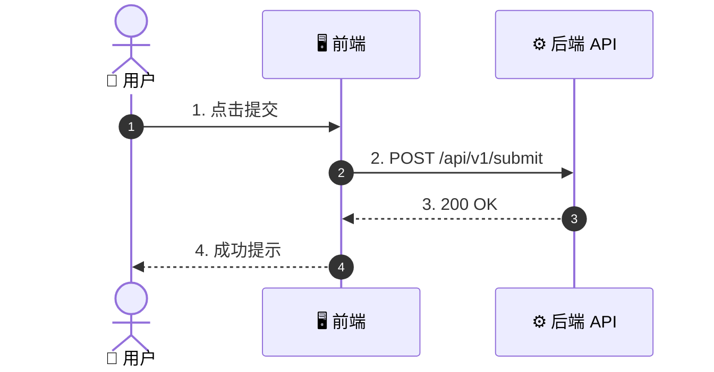
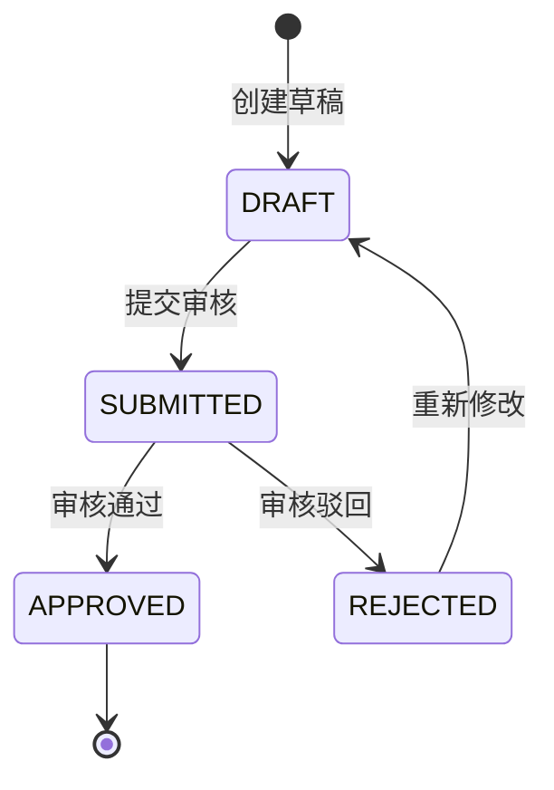
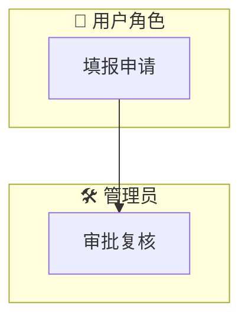
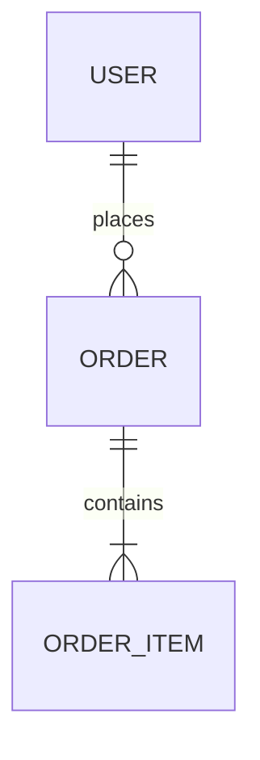
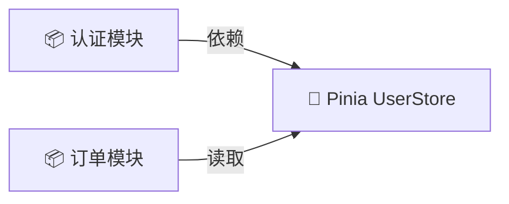

# 📐 Mermaid 五大黄金图表语法规范与避坑指南

生成的 Mermaid 图表必须直接能在 Markdown 阅读器与 GitHub/IDE 中流畅渲染。请严格遵守以下防错规范：

---

## 1. 语法与高对比度渲染三大铁律

1. **🎨 字体高对比度与防同色遮挡 (High Contrast & Clear Fonts)**：
   - **文字与背景颜色对比**：**严格禁止深色背景配深色文字，或浅色背景配浅色文字**！深色节点背景（如 `#1E293B` / `#0F172A`）必须强制使用高亮白色/浅色文字（`color:#FFFFFF` / `#F8FAFC`）。
   - **防文字折叠与箭头重叠遮挡**：节点内部的长文本**必须使用 ` ` 显式换行**，防止文本太长导致节点挤压、文字与线段箭头产生物理覆盖遮挡。

2. **节点文本双引号转义**：
   - 包含中括号 `[]`、圆括号 `()`、特殊符号时，节点 label **必须加双引号**！
   - ✅ **正确**: `A["用户登录 (User) (含 JWT 凭证)"] --> B["请求 API"]`
   - ❌ **错误**: `A[用户登录 (User)] --> B`

3. **子图 (subgraph) 命名防冲突**：
   - `subgraph` 必须带有唯一英文 ID 和用双引号包围的显示标题。
   - ✅ **正确**: `subgraph FE_LAYER ["🖥️ 前端渲染层"]`

---

## 2. 5 大黄金图表标准模版

### 1. 时序图 (`sequenceDiagram`)

### 2. 状态机图 (`stateDiagram-v2`)

### 3. 泳道图 (`graph TD` + `subgraph`)

### 4. ER 图 (`erDiagram`)

### 5. 模块依赖关系图 (`graph LR`)

