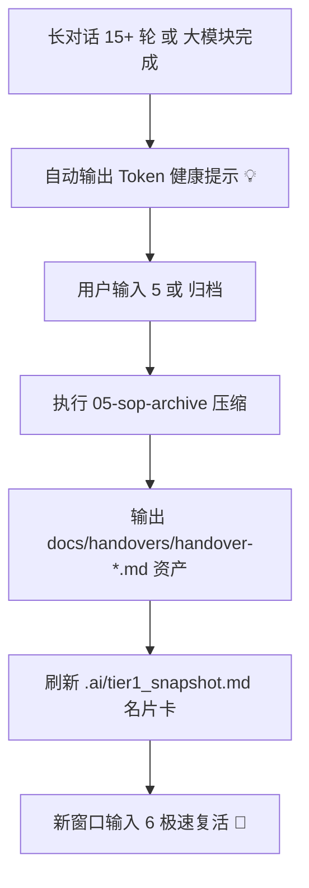

# 🛟 Agent 上下文交接卡与 Token 衰减告警规范 (Agent Handover Protocol)

## 📌 目标与背景

在使用大语言模型进行长研发会话（20+ 轮）或跨模块、多 Agent 协作时，容易遇到以下问题：
1. **上下文窗口膨胀 (Context Congestion)**：长对话导致静态 Token 与历史 Stack 占用过高，大模型开始出现注意力衰减、遗忘规则或产生契约幻觉。
2. **跨窗口/跨 Agent 记忆撕裂**：关闭窗口或在不同 Agent 之间切换时，缺失标准化的研发交接卡（Handover Artifact），导致新 Agent 需要重新扫描全盘代码才能定位当前断点。

本规范定义了**Token 衰减主动告警机制**与**标准化 Handover Artifact 导出契约**。

---

## 💡 一、 Token 衰减主动告警机制 (Context Decay Warning)

在所有 SOP（如 02-coding, 03-debug, 04-review）的交互响应末尾，AI 必须监控当前对话的上下文膨胀状态：

### 1. 触发条件 (Trigger Conditions)
- 当同一会话累积对话轮次达到 **15 ~ 20 轮** 时；
- 当完成了一个大版本/大模块的核心 Task（如完成全套 DLD 接口联调）时。

### 2. 标准预警文本 (Warning Template)
AI 必须在回复卡片底部增加如下轻量友情提示：

> 💡 **上下文健康提醒 (Context Health Check)**：
> 当前会话窗口轮次较多。为避免 Token 膨胀导致 AI 注意力衰减或产生契约幻觉，**强烈建议发送 `[5]` 归档上下文**；归档后在新窗口发送 `[6]` 即可 3 秒恢复记忆继续工作！

---

## 📦 二、 标准 Agent 交接卡规范 (Handover Artifact Standard)

在执行 `[5]`（05-sop-archive）进行无损归档，或进行跨模块/跨 Agent 移交时，除了自动更新 `.ai/tier3_handover.md`，必须在 `docs/handovers/` 目录下自动导出一份标准化交接文档：

### 1. 文件命名与存储规范 (File Naming)
`docs/handovers/handover-{YYYYMMDD}-{MODULE/TASK_ID}.md`

### 2. 交接卡模版 (Artifact Template)

```markdown
# 📦 研发交接卡 (Handover Artifact)

> **归档时间**：YYYY-MM-DD HH:mm:ss
> **交接模块/Task**：[Task-XXX] - [模块名称]
> **交接状态**：🟢 核心功能完成 / 🟡 存在待处理隐患 / 🔴 中断待修补

---

### 1. 🎯 本次完成核心白话清单
- [x] 完成了 XX 接口的 Controller 与 Service 编写（已通过 TDD 测试）。
- [x] 修改了 `t_user` 表结构，增加了 `phone` 字段。

### 2. 🛠️ 改动资产与契约清单
- **数据库 Migration**：`docs/migrations/V1_0_1__add_phone.sql`
- **核心代码文件**：`UserController.java`, `UserService.java`
- **关联设计文档**：`docs/modules/user/dld-user-v1.0.md`

### 3. ⚠️ 遗留隐患与注意点 (Gotchas & Risks)
- `UserServiceTest.java` 中仍有 1 个边界测试用例未跑通，需要后续补全 Mock 参数。
- 本次改动影响了 `AuthInterceptor`，请后续重点回归登录模块。

---

### 🚀 给下一个 AI / 开发者的 3 步起手式 (Quickstart for Next Agent)
1. 运行 `python3 .ai/scripts/sync_tree.py` 确保目录树同步。
2. 读取 `.ai/tier1_snapshot.md` 锁定目前 ACTIVE 焦点。
3. 直接发送 `[2]` 启动代码编写或 `[3]` 针对遗留问题进行调试。
```

---

## 🔄 三、 运行闭环


