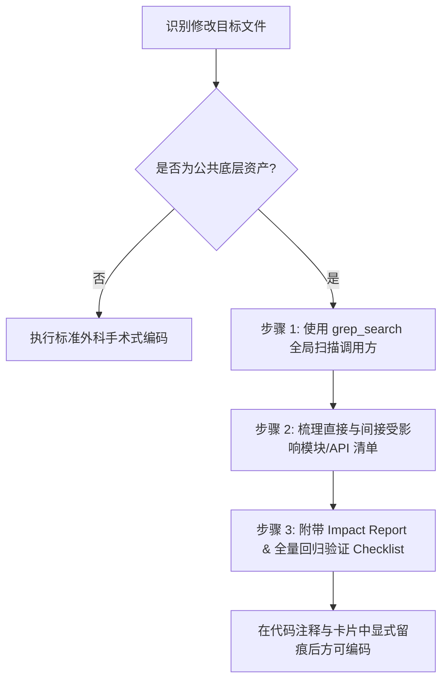

# 🔍 公共底层代码修改影响范围自判协议 (Impact Analysis Checklist)

## 📌 目标与背景

在敏捷编码与 AI 辅助开发中，最容易引发灾难性错误的场景是：**AI 在完成当前微观 Task 时，顺手修改或修改了公共底层组件，导致上游其他原本正常的业务模块静默崩溃**。

本协议强制要求 AI 在触碰任何“公共底层代码/资产”时，必须主动执行影响范围扫描并生成回归测试清单。

---

## 🛡️ 一、 公共底层代码/资产判定标准 (Public Asset Matrix)

若修改的目标文件满足以下任意一条，即自动触发 **高风险公共代码影响范围检查**：

| 资产分类 | 代表性文件/模块标识 | 典型风险点 |
| :--- | :--- | :--- |
| **通用 Base 基类** | `BaseEntity`, `BaseController`, `BaseService`, `BaseMapper` | 影响全局实体数据映射与基础 CRUD |
| **全局拦截/中间件** | `AuthInterceptor`, `JwtFilter`, `GlobalExceptionHandler`, `CorsConfig` | 影响全局权限校验、请求头解析与异常捕捉 |
| **核心公共响应/枚举**| `R<T>`, `Result`, `ErrorCode`, `UserContext`, `GlobalStatusEnum` | 影响前端 Axios 解析及全局 JSON 结构契约 |
| **全局配置类** | `SecurityConfig`, `WebMvcConfig`, `MyBatisPlusConfig`, `RedisConfig` | 影响全局路由阻断、数据库分页与缓存切面 |
| **公共 Util 工具类** | `JwtUtil`, `DateUtil`, `RedisUtil`, `SecurityUtils`, `HttpUtils` | 隐蔽方法签名改动导致上游依赖方运行时报错 |

---

## 🛠️ 二、 三步走影响扫描协议 (3-Step Impact Analysis Protocol)



### 步骤 1: 全局依赖扫描 (Dependency Grep)
在修改公共类/工具方法签名前，AI 必须使用 `grep_search` 在项目中搜索该类名或方法名：
- 搜索指令范例：`grep_search(Query="JwtUtil.getUserId", SearchPath="src/")`
- 目的：精准定位项目中所有调用了该公共资产的文件路径与行号。

### 步骤 2: 受影响模块分级梳理 (Impact Radius Classification)
将扫描出来的依赖点按受影响程度分类：
1. **直接破裂风险 (Direct Breaking Change)**：修改了公共方法入参、返回值类型、抛出的异常类型或删除/重命名了公共字段。
2. **行为漂移风险 (Behavioral Drift)**：修改了公共方法的底层逻辑（如调整了时间格式化格式、调整了 Token 过期秒数），调用的方法签名没变但运行逻辑已变。
3. **安全/权限连带风险 (Security/Permission Radius)**：修改了全局 Auth 拦截拦截规则或白名单配置。

### 步骤 3: 输出影响报告与回归 Checklist
编码前在输出卡片或代码说明中包含以下标准化区块：

```markdown
#### ⚠️ 公共资产修改影响报告 (Impact Assessment Report)
- **修改公共组件**：`com.apex.common.result.R<T>`
- **受影响上游模块**：
  - [x] `UserController.java` (影响登录/获取个人信息接口)
  - [x] `OrderController.java` (影响下单/列表查询接口)
- **回归验证要求**：需全量跑通 `UserController` 和 `OrderController` 的契约测试。
```

---

## 🔒 三、 禁忌铁律 (Strict Rules)

1. **严禁无声修废 (Silent Mutation)**：严禁在未告知用户且未扫描依赖的情况下，直接修改公共工具类的公开静态方法签名。
2. **必须向前兼容 (Backward Compatibility)**：若需扩展公共工具方法，优先采用**方法重载 (Overloading)** 追加重载函数，禁止直接改动既有重载函数的参数顺序或类型。
3. **保留原字段弃用标记**：若公共 Enum 或 VO/DTO 中的某字段不再推荐使用，严禁直接删除，应用 `@Deprecated` / Javadoc 标记，确保旧接口过渡平滑。
