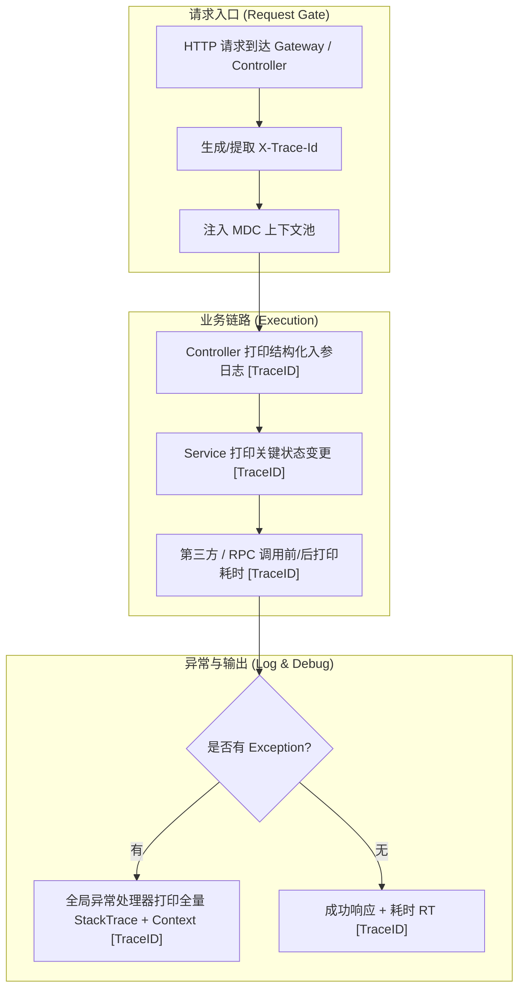

# 📊 可观测性打点与结构化日志诊断规范 (Observability & Logging Standard)

> **版本**：V1.0  
> **适用场景**：全局链路追踪 (TraceID)、分层结构化日志打印、异常现场快照记录，以及小黄鸭探针高效排错支撑。

---

## 🏛️ 一、 可观测性的核心理念：让日志真正能说人话

高效的排错（Task-02 小黄鸭探针）与经验反哺（Task-20）极其依赖干净、上下文完整、可追溯的日志。



---

## 🏷️ 二、 MDC TraceID 链路贯穿规范

所有服务日志格式必须统一包含 `[TraceID]` 占位符，防止并发请求日志混杂导致排查失明。

### 1. Logback / Log4j2 模式配置
```xml
<!-- 日志输出格式模版 -->
<property name="LOG_PATTERN" 
          value="%d{yyyy-MM-dd HH:mm:ss.SSS} [%thread] [%X{traceId:-SYSTEM}] %-5level %logger{36} - %msg%n" />
```

### 2. Spring Boot 拦截器 MDC 注入标准
```java
public class TraceIdInterceptor implements HandlerInterceptor {
    private static final String TRACE_ID_HEADER = "X-Trace-Id";

    @Override
    public boolean preHandle(HttpServletRequest request, HttpServletResponse response, Object handler) {
        String traceId = request.getHeader(TRACE_ID_HEADER);
        if (StringUtils.isBlank(traceId)) {
            traceId = UUID.randomUUID().toString().replace("-", "");
        }
        MDC.put("traceId", traceId);
        response.setHeader(TRACE_ID_HEADER, traceId);
        return true;
    }

    @Override
    public void afterCompletion(HttpServletRequest request, HttpServletResponse response, Object handler, Exception ex) {
        MDC.remove("traceId");
    }
}
```

---

## 📝 三、 分层日志打印 4 大规约 (Tiered Logging Rules)

### 1. Controller 入口/出口层规约
* **打印时机**：请求进入时打 `INFO` 入参日志，响应返回时打 `INFO` 出参/耗时日志。
* **日志规范**：
  ```java
  log.info("[OrderController] 收到创建订单请求 | userId: {}, itemCode: {}, amount: {}", userId, itemCode, amount);
  // ... 执行业务 ...
  log.info("[OrderController] 创建订单成功 | orderNo: {}, cost: {}ms", orderNo, costTime);
  ```

### 2. Service 核心业务层规约
* **打印时机**：核心状态转换（如 `PENDING -> PAID`）、重要分支跳转以及外部 API (如支付网关/微信 API) 调用前后。
* **日志规范**：
  ```java
  log.info("[OrderService] 开始处理订单支付状态变更 | orderNo: {}, oldStatus: {}, newStatus: {}", orderNo, oldStatus, newStatus);
  ```

### 3. Exception 统一异常处理器规约
* **打印时机**：捕获未处理异常或抛出 `BusinessException` 时。
* **日志规范**：**必须带上关键业务 context 参数 + 原始 Exception 堆栈**，严禁只输出 `log.error(e.getMessage())`！
  ```java
  // 🟢 正确做法：带上关键参数与完整堆栈
  log.error("[GlobalExceptionHandler] 订单支付处理失败 | orderNo: {}, userId: {}", orderNo, userId, ex);
  ```

### 4. 敏感数据脱敏守则 (Secret Masking Rule)
打印入参出参时，必须遵循秘钥脱敏规约（Task-13）：
- **密码/Token/密钥**：使用 `***` 遮蔽。
- **手机号/身份证**：保留前3后4，中间打星号（如 `138****1234`）。

---

## 🛠️ 四、 质量看门狗检查项 (Watchdog Check)

在代码生成与质量检查阶段，激活 Observability 看门狗：

- [ ] Controller/Service 是否已注入 `@Slf4j` 或日志句柄。
- [ ] 关键业务入口是否打印了包含唯一标识（如 `userId`/`orderNo`）的结构化日志。
- [ ] 统一异常处理是否保留了完整 `Throwable ex` 堆栈。
- [ ] 日志模式配置中是否包含了 `[%X{traceId}]` 链路追踪字段。
