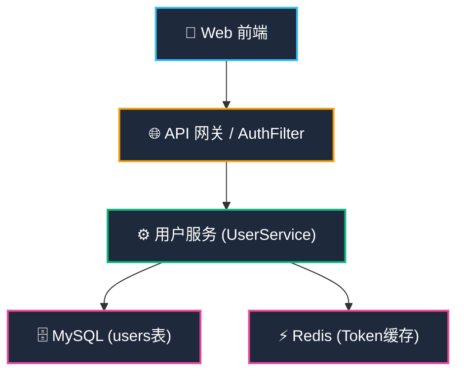
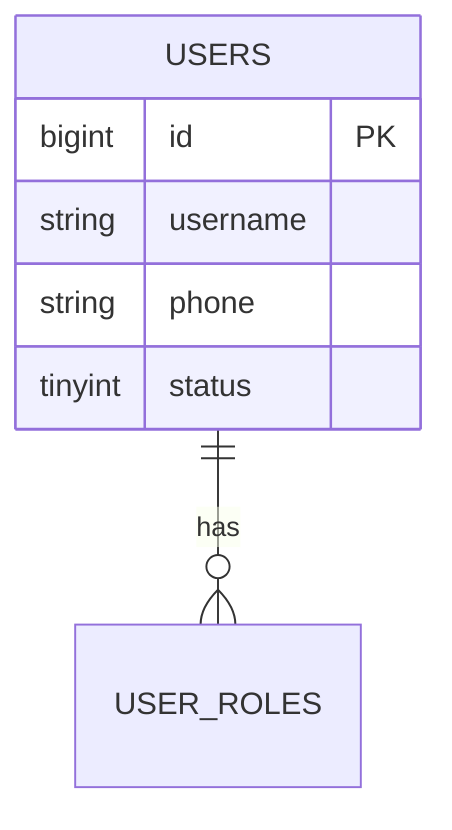

# 💡 Design-Spec-Architect 标杆范例 (用户管理模块 HLD & DLD 完整产出示例)

> **范例说明**：本示例展示了在完成 `prd-user-v1.0.md` 规划后，激活 `design-spec-architect` Skill 遵循【钧天科技 V1.0 标准】生成的概要设计说明书 (HLD) 与详细设计说明书 (DLD) 规范落盘示例。

---

## 🏛️ 1. 概要设计说明书范例 (`docs/modules/user/hld-user-v1.0.md`)

```markdown
# 用户管理模块 概要设计说明书 (HLD)

## 📋 文件修订页

| 编号 | 章节名称 | 修订内容描述 | 修订日期 | 修订版本 | 修订人 |
| :--- | :--- | :--- | :--- | :--- | :--- |
| 1 | 所有章节 | 初始版本创建 | 2026-06-09 | V1.0 | AI Agent |

---

## 1 概述
### 1.1 编写目的
明确用户管理模块的系统整体架构、分层职责与网络部署，为详细设计及开发提供依据。

---

## 2 系统总体设计
### 2.1 核心技术选型
| 分类 | 选型方案 | 选型说明 |
| :--- | :--- | :--- |
| 开发框架 | Spring Boot 3.x / Vue3 | 前后端分离 |
| 存储/缓存 | MySQL 8.0 / Redis 7.0 | 用户主表存储 / JWT 令牌缓存 |

### 2.2 总体架构设计

```

---

## 🗄️ 2. 详细设计说明书范例 (`docs/modules/user/dld-user-v1.0.md`)

```markdown
# 用户管理模块 详细设计说明书 (DLD)

## 📋 文件修订页

| 编号 | 章节名称 | 修订内容描述 | 修订日期 | 修订版本 | 修订人 |
| :--- | :--- | :--- | :--- | :--- | :--- |
| 1 | 所有章节 | 初始版本创建 | 2026-06-09 | V1.0 | AI Agent |
| 2 | 6.3 表结构设计 | 新增 user_status 软删除字段与索引 | 2026-06-10 | V1.1 | AI Agent |

---

## 5 接口详细设计

### 5.1 内部接口明细

#### 5.1.1 获取用户详情接口
- **请求 URL**：`GET /api/v1/users/{id}`
- **响应参数 JSON**：
  ```json
  {
    "code": 200,
    "message": "success",
    "data": {
      "id": 1001,
      "username": "zhangsan",
      "phone": "13800138000",
      "status": 1
    }
  }
  ```

---

## 6 数据库详细设计

### 6.1 实体 ER 图


### 6.2 表结构设计 (`sys_users`)
| 字段名 | 数据类型 | 长度 | 是否主键 | 是否允许为空 | 默认值 | 备注 |
| :--- | :--- | :--- | :---: | :---: | :--- | :--- |
| `id` | `BIGINT` | 20 | 是 | 否 | AUTO_INCREMENT | 主键 ID |
| `username` | `VARCHAR` | 64 | 否 | 否 | 无 | 登录用户名 |
| `status` | `TINYINT` | 2 | 否 | 否 | `1` | 账号状态 (1:正常 0:禁用) |
```
