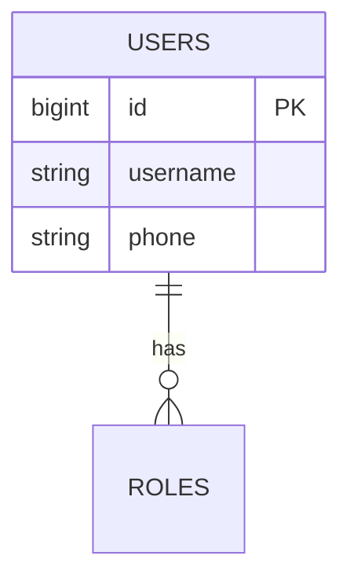

# XX 产品名称 详细设计说明书 (DLD)

---

## 📋 文件修订页 (Revision History)

| 编号 | 章节名称 | 修订内容描述 | 修订日期 | 修订版本 | 修订人 |
| :--- | :--- | :--- | :--- | :--- | :--- |
| 1 | 所有章节 | 初始版本创建 | YYYY-MM-DD | V0.1 | AI Agent |
| 2 | 所有章节 | 评审通过正式发布 | YYYY-MM-DD | V1.0 | AI Agent |

---

## 1 概述

### 1.1 编写目的
细化软件系统的整体设计、明确各模块的实现细节、算法、数据结构、接口参数与异常处理，指导编码开发与测试验证。

### 1.2 术语与定义
| 序号 | 术语 | 定义 |
| :--- | :--- | :--- |
| 1 | DLD | 详细设计说明书 (Detailed Design Specification) |

### 1.3 参考资料
| 序号 | 标准名称 | 标准文号 |
| :--- | :--- | :--- |
| 1 | 《国家电网公司应用软件架构设计规范》 | OS-L3-SD57-01 |

---

## 2 总体架构详细设计

### 2.1 架构分层详情
| 架构层级 | 部署节点 | 硬件配置要求 | 核心软件组件 | 核心功能 |
| :--- | :--- | :--- | :--- | :--- |
| 应用/服务层 | 应用服务器 | CPU $\ge 16$核, 内存 $\ge 32$GB | 服务计算框架 | 业务逻辑处理、API 路由 |
| 数据存储层 | 数据库服务器 | CPU $\ge 24$核, 内存 $\ge 64$GB | MySQL 主从 / Redis | 数据持久化与热点缓存 |

### 2.2 系统整体架构
呈现完整的系统模块架构拓扑与交互关系。

---

## 3 总体设计约束

### 3.1 技术约束
- **开发语言**：后端建议 Go / Java / Node.js，前端统一 TypeScript / Vue3 / React。
- **数据格式**：模块间通信数据统一采用 JSON 格式。
- **数据库约束**：表名与字段名统一采用小写下划线命名，必须包含主键。

### 3.2 性能约束
- 内部接口响应时间 $\le 500$ms，外部接口 $\le 1$s，Web 页面加载时间 $\le 2$s。

### 3.3 安全约束
- 敏感数据传输必须加密，绝不在日志中明文打印密码与 Token。

---

## 4 核心模块详细设计

### 4.1 [XX 模块]

#### 4.1.1 模块概述
描述该模块的具体业务功能与设计目标。

#### 4.1.2 代码目录结构设计
```plaintext
src/
├── controllers/      # 路由与请求校验
├── services/         # 核心业务逻辑
├── models/           # 数据模型与 ORM
└── utils/            # 通用工具函数
```

#### 4.1.3 数据模型设计
| 模型名称 | 核心属性 | 核心方法 | 描述 |
| :--- | :--- | :--- | :--- |
| `UserManager` | `userId`, `role`, `status` | `createUser()`, `verifyToken()` | 用户身份与权限核心管理模型 |

#### 4.1.4 核心模型参数模板
| 模型名称 | 基础参数模板 | 高级参数模板 | 适用场景 |
| :--- | :--- | :--- | :--- |
| `AuthModel` | 密钥长度 256位、过期时间 7200秒 | 刷签算法 HS256 | 登录令牌发放与校验 |

---

## 5 接口详细设计

### 5.1 内部接口设计

#### 5.1.1 [XX 接口]
- **接口名称**：获取用户明细
- **请求 URL**：`/api/v1/user/detail`
- **请求方法**：`GET`
- **请求参数表**：
  | 参数名 | 类型 | 必选 | 描述 |
  | :--- | :--- | :--- | :--- |
  | `user_id` | `String` | 是 | 用户唯一标识 ID |
- **响应参数 JSON**：
  ```json
  {
    "code": 200,
    "message": "success",
    "data": {
      "userId": "1001",
      "username": "admin"
    }
  }
  ```
- **响应时间要求**：$\le 500$ms
- **权限要求**：登录认证用户

---

## 6 数据库详细设计

### 6.1 数据整体规划
说明数据库存储方案、主从复制与读写分离策略。

### 6.2 实体 ER 图


### 6.3 表结构设计 (`[table_name]`)
| 字段名 | 数据类型 | 长度 | 是否主键 | 是否允许为空 | 默认值 | 备注 |
| :--- | :--- | :--- | :---: | :---: | :--- | :--- |
| `id` | `BIGINT` | 20 | 是 | 否 | AUTO_INCREMENT | 主键 ID |
| `username` | `VARCHAR` | 64 | 否 | 否 | 无 | 用户名 |
| `created_at` | `DATETIME` | - | 否 | 否 | `CURRENT_TIMESTAMP` | 创建时间 |

### 6.4 索引设计
| 表名 | 索引类型 | 索引字段 | 索引用途 |
| :--- | :--- | :--- | :--- |
| `users` | 唯一索引 | `phone` | 保证手机号全局唯一性 |

---

## 7 非功能需求详细设计

### 7.1 安全性设计
- **身份认证**：账号密码+验证码/双因素认证，JWT 令牌管理（有效期 2 小时）。
- **数据安全**：敏感字段 AES-256 加密，全量操作日志存留 $\ge 180$ 天。

### 7.2 性能设计
- **响应时间与并发**：核心接口 $\le 1$s，支持 $\ge 1000$ 用户同时在线。

### 7.3 高可用与异常容错设计
- **接口容错**：超时重试 (最多 3 次，间隔 1s)。
- **依赖容错**：第三方服务调用失败时启用降级策略，返回保底默认值。

---

## 8 风险与应对设计

| 风险类型 | 应对措施 | 设计体现 |
| :--- | :--- | :--- |
| 数据库性能瓶颈 | 主从读写分离、核心字段建立索引 | 建立索引设计表与 Redis 热点缓存 |
