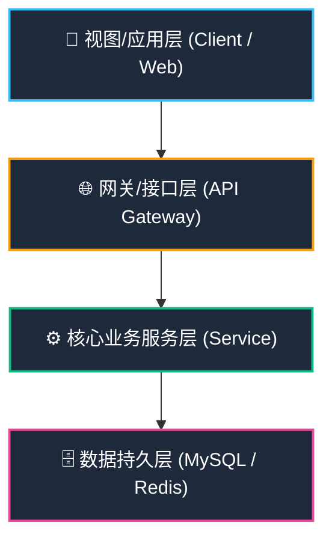

# XX 产品名称 概要设计说明书 (HLD)

---

## 📋 文件修订页 (Revision History)

| 编号 | 章节名称 | 修订内容描述 | 修订日期 | 修订版本 | 修订人 |
| :--- | :--- | :--- | :--- | :--- | :--- |
| 1 | 所有章节 | 初始版本创建 | YYYY-MM-DD | V0.1 | AI Agent |
| 2 | 所有章节 | 评审通过，发布正式版本 | YYYY-MM-DD | V1.0 | AI Agent |

---

## 1 概述

### 1.1 编写目的
明确系统的整体架构与设计方案，将需求转化为概要设计，指导后续详细设计说明书编写、编码开发与测试验证。

### 1.2 术语与定义
| 序号 | 术语 | 定义 |
| :--- | :--- | :--- |
| 1 | HLD | 概要设计说明书 (High-Level Design)，规定系统总体结构、模块分工与内外接口 |

### 1.3 参考资料与标准
| 序号 | 标准名称 / 参考资料 | 标准文号 / 来源 |
| :--- | :--- | :--- |
| 1 | 《国家电网公司应用软件架构设计规范》 | OS-L3-SD57-01 |

---

## 2 系统总体设计

### 2.1 设计原则
- **解耦可扩展原则**：采用分层架构与微服务/模块化思想，各模块独立交互，支持横向扩容。
- **易用性与可靠性原则**：兼顾运维与使用场景，设计可视化配置，保证高可用性。

### 2.2 核心技术选型
| 分类 | 选型方案 | 选型说明 |
| :--- | :--- | :--- |
| 开发框架 | Spring Boot / Vue.js | 前后端分离架构 |
| 数据库 | MySQL 8.0 / PostgreSQL | 业务数据持久化存储 |
| 存储/缓存 | Redis / HDFS | 高频热数据缓存与日志存储 |
| 加密算法 | SM4 国密算法 / AES-256 | 数据传输与存储加密 |
| 部署容器 | Docker / K8s 集群 | 容器化轻量部署 |

### 2.3 总体架构设计

#### 2.3.1 架构图

#### 2.3.2 架构说明
描述系统分层设计职责及各层之间的交互协议规范。

#### 2.3.3 系统整体数据流图

---

## 3 功能模块设计

### 3.1 [模块名称] 模块
#### 3.1.1 功能描述
绘制该模块功能流程图或文字描述主要实现什么，支持什么操作。

#### 3.1.2 子模块设计
描述该功能有哪些子模块及模块调用流程。

---

## 4 接口设计

### 4.1 接口设计原则
- **标准化原则**：采用 RESTful API 作为核心接口规范，统一请求/响应格式。
- **安全性原则**：接口调用需携带身份认证 Token，敏感接口支持权限校验。

### 4.2 接口设计
#### 4.2.1 内部接口
内部组件通信接口规范与协议格式。

#### 4.2.2 外部接口
第三方系统或硬件接入对接接口规范。

---

## 5 数据设计

### 5.1 数据分类及存储方案
| 数据类型 | 包含内容 | 存储介质 | 存储周期 |
| :--- | :--- | :--- | :--- |
| 实时数据 | 状态告警、运行数据 | 内存数据库 (Redis) | 7 天 (滚动覆盖) |
| 历史数据 | 历史日志、报表数据 | 关系型数据库 (MySQL) | 审计数据 $\ge 6$ 个月 |

---

## 6 部署设计

### 6.1 部署模式与服务器配置
- **部署模式**：私有云部署 / Docker 容器化部署 (K8s 编排)
- **服务器配置清单**：
  - **应用服务器**：CPU $\ge 16$核，内存 $\ge 32$GB，磁盘 $\ge 500$GB
  - **数据库服务器**：CPU $\ge 24$核，内存 $\ge 64$GB，磁盘 $\ge 2$TB (SSD 主从)
  - **缓存服务器**：CPU $\ge 8$核，内存 $\ge 32$GB (Redis 集群)

---

## 7 非功能需求设计

### 7.1 安全性设计
- **身份认证**：账号密码+验证码登录，初始密码强制修改。
- **权限控制**：基于 RBAC 模型，核心操作二次确认与日志留痕。
- **数据加密**：传输采用 TLS 1.2+，敏感存储 AES-256 加密。

### 7.2 性能设计
- **并发能力**：支持 $\ge 1000$ 用户同时在线，$\ge 200$ 用户并发操作。
- **响应时间**：核心页面加载 $<2$ 秒，接口响应 $\le 1$ 秒。

### 7.3 可观测性设计 (可选)
包含链路追踪 (Trace)、日志 (Log) 和监控指标 (Metric) 三部分。

### 7.4 兼容性设计
- 浏览器适配：Chrome 69+、Edge 94+、Firefox 88+、Safari 14+。

### 7.5 可靠性与可用性设计
- 年系统可用性 $\ge 99.9\%$，支持 7×24 小时连续运行。

---

## 8 风险与应对设计

| 风险类型 | 风险描述 | 风险级别 | 应对措施 |
| :--- | :--- | :---: | :--- |
| 性能风险 | 高并发计算与存储压力激增 | 中 | 分布式架构横向扩展、结果缓存与分片存储 |
| 安全风险 | 数据篡改或敏感日志被删 | 高 | 探针数字签名校验、日志哈希链防篡改设计 |
