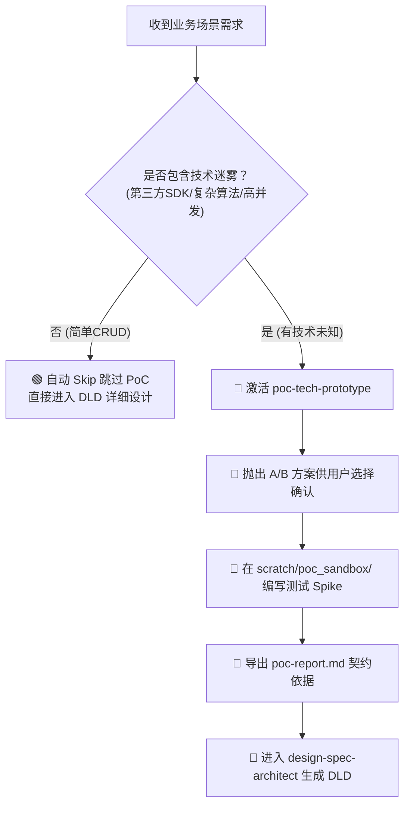

# ⚡ 技术原型 (PoC) 沙盒分析框架 (poc-framework.md)

## 📌 1. 技术 PoC 决策树 (Decision Matrix)

## 📌 2. PoC 报告模板结构 (`poc-report.md`)
1. **测试目标与背景**
2. **核心技术选型结论 (方案 A/B 决策)**
3. **真实调用入参/出参 JSON Payload**
4. **性能/并发边界数据**
5. **合入 DLD 的核心建议**
