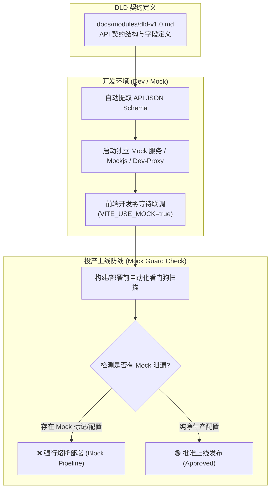

# 🧪 契约驱动 Mock 数据、Seed 数据生成与投产安全看门狗规范 (Mock & Seed Data Protocol)

> **版本**：V1.0  
> **适用场景**：前后端并行开发、零等待联调、自动化测试种子数据填充，以及生产打包时的 **Mock 泄漏防范拦截 (Mock Guard)**。

---

## 🏛️ 一、 契约驱动 Mock 独立解耦架构

为了防止开发人员在业务代码中滥用 `if (isMock) { return mockData; }` 造成线上生产环境漏洞，Apex 规范要求 **Mock 逻辑与生产业务代码完全物理解耦**。



### 1. 核心架构原则
1. **零业务侵入**：后端 Spring Boot / Node Controller 代码中**严禁**编写任何硬编码 Mock 分支逻辑。
2. **独立代理/独立 Server**：Mock 接口由前端 dev-server 中中间件 (如 `vite-plugin-mock`) 或独立的轻量 Mock 服务（如 WireMock / Express Mock Server）打理，仅监听开发端口（如 `http://localhost:3000/mock-api`）。
3. **环境变量开关**：前端必须通过 `.env.development` 中的 `VITE_USE_MOCK=true` 启用，生产配置 `.env.production` 强行锁定为 `VITE_USE_MOCK=false`。

---

## 🏷️ 二、 Mock 接口的“三重安全标记”规范

为确保开发人员、测试探针以及上线看门狗能 100% 精准识别 Mock 数据，所有生成的 Mock 接口必须植入以下三重特征标记：

### 1. HTTP 响应头强标记 (Header Flag)
所有 Mock 响应在 Response Header 中必须注入：
```http
HTTP/1.1 200 OK
X-Apex-Mock: true
X-Apex-Mock-Source: Apex-Contract-MockEngine
X-Apex-Mock-Timestamp: 1765000000
```

### 2. JSON Response 根节点特征字段 (Body Meta)
JSON 响应体根层添加调试元数据属性：
```json
{
  "code": 200,
  "msg": "操作成功",
  "data": { ... },
  "_mock_meta": {
    "is_mock": true,
    "contract_version": "v1.0",
    "notice": "⚠️ WARNING: THIS IS A MOCK RESPONSE. DO NOT USE IN PRODUCTION."
  }
}
```

### 3. 路由前缀隔离 (URL Prefix Isolation)
Mock 接口的基础 URL 路径必须带有明确的 `/mock-api/` 前缀，绝不直接占用正式生产 API 路径 `/api/v1/`：
- 开发 Mock 路径：`http://localhost:3000/mock-api/v1/orders/list`
- 生产正式路径：`https://api.yourdomain.com/api/v1/orders/list`

---

## 🛡️ 三、 投产上线前的【Mock 泄漏防范看门狗】 (Mock Guard Check)

针对用户最关心的“**投产时忘记接口还是 Mock 该怎么处理？**”，工作流在 `04-sop-review` 和打包部署流水线注入 **三重断路门禁 (Pre-deployment Guard Check)**：

### 1. 静态配置检查看门狗 (Static Config Guard)
在执行生产构建（如 `npm run build` 或 `mvn package`）前，探针脚本扫描打包目录：
- 检查 `.env.production` / `application-prod.yml`，若发现 `USE_MOCK=true` 或包含 `localhost` / `mock-api`，脚本直接退出并强行中断构建。
- 扫描打包产物代码（如 `dist/bundle.js`），查找是否存在硬编码的 `X-Apex-Mock` 字符串或 `/mock-api/` 路由。

### 2. 运行时 HTTP 探针抽检 (Live Probing Guard)
在代码发布到预发环境 (Staging) 或生产候选集群 (Pre-prod) 后，`quality-verifier` 自动对关键 API 发起探针检测：
- 逐个校验返回头的 `Header`。若在生产候选地址中读取到 `X-Apex-Mock: true`，立即触发**紧急报警 (PRODUCTION_MOCK_LEAK_ALERT)**：
```bash
❌ [CRITICAL ALERT] 生产环境候选接口 [POST https://api.xxx.com/api/v1/order] 返回了 Mock 响应头 X-Apex-Mock: true！
已强行拦截上线发布操作！请立刻检查 API 网关路由或环境配置！
```

### 3. 人工 Sign-off 确认卡牌 (Deployment Approval Gate)
上线前的评审阶段（SOP-04 Review）生成 `docs/handovers/release-checklist.md` 确认卡：
- [ ] 环境变量 `.env.production` 已核验（`VITE_USE_MOCK = false`）。
- [ ] Mock 自动化看门狗探针校验通过 (`Mock Guard: 🟢 PASSED`)。
- [ ] 独立 Mock 端口（如 3000）已从生产安全组/防火墙封禁隔离。

---

## 🌱 四、 数据库种子数据 (Seed Data) 自动生成规范

除了接口 Mock 外，数据库空表同样会导致开发与测试受阻。根据 DLD 表结构，AI 自动在 `docs/seed-data/` 目录下输出 `dev_seed_<module>_v1.0.sql`：

### 1. 数据分类与填充覆盖规则
种子脚本包含三大类数据：
1. **正向基础数据 (Standard Seed Data)**：5~10 条规范数据，用于基础页面渲染与功能体验。
2. **边界与异常数据 (Edge Case Data)**：
   - 包含超长文本（如 200 字用户备注）、特殊字符（`SQL注入/XSS脚本字符串`）。
   - 状态极值数据（如已删除、已冻结、金额为 0、扣减至负数）。
3. **批量压测数据 (Bulk Benchmark Seed)**：1000 条标准结构数据，用于测试前端表格分页性能与后端 SQL 慢查询。

### 2. 种子数据安全隔离铁律
- 种子数据文件名严格命名为 `dev_seed_*.sql`，**禁止在生产环境数据库上执行**！
- 脚本头部统一增加环境校验逻辑（例如仅允许在 `dev_db` 或 `test_db` 执行）：
```sql
-- ⚠️ SAFETY GUARD: ONLY RUN THIS SCRIPT IN DEVELOPMENT/TEST DATABASE!
SELECT IF(DATABASE() LIKE '%prod%', 
    (SELECT table_name FROM information_schema.tables), 
    'SAFE_TO_RUN') AS db_safety_check;
```

---

## 🛠️ 五、 操作指引与命令

使用 `quality-verifier` 自动生成 Mock 规则与种子脚本：

```bash
# 1. 根据 DLD 契约生成 Mock 配置文件与种子 SQL
python3 .agents/skills/quality-verifier/scripts/generate_mock_and_seed.py <module_name>

# 2. 上线前执行 Mock 泄漏安全扫码看门狗
python3 .agents/skills/quality-verifier/scripts/verify_mock_guard.py --env=production
```
