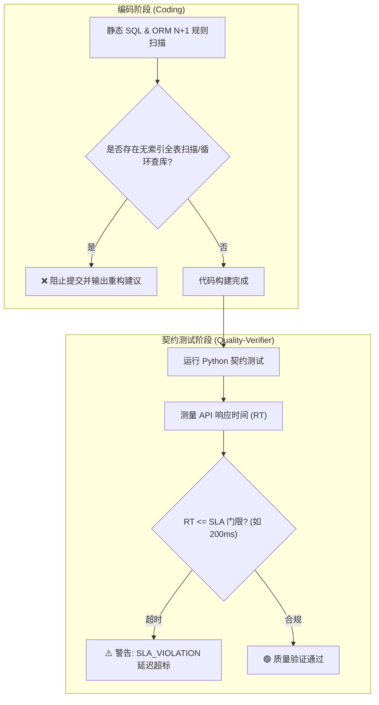

# ⏱️ 性能基准与 SQL 慢查询防线规范 (Performance & Slow Query Guard)

> **版本**：V1.0  
> **适用场景**：静态代码 SQL 风险扫描、ORM N+1 坏味道拦截、自动化契约测试 SLA 响应时间 (RT) 延迟校验。

---

## 🏛️ 一、 性能防线的核心理念：双重把关机制

单靠线上 Prometheus / SkyWalking 监控是“事后救火”。Apex 工作流要求在 **开发编码与质量验证阶段 (Shift-Left)** 就通过双重看门狗拦截性能隐患：



---

## 🔍 二、 防线 A：静态 SQL 与 ORM 代码探针扫描规则

在代码提交或 PR 扫描时，静态检测 SQL / MyBatis XML / ORM 调用中的 4 类典型性能陷阱：

### 1. 无 Limit 约束的大表裸查 (Unbounded Queries)
* **违规模式**：`SELECT * FROM t_order WHERE user_id = 123`（未加分页或 `LIMIT` 保护）。
* **整改要求**：所有列表查询强制在 ORM 传递 `Page` 对象，或显式拼接 `LIMIT 100`，防止瞬间拉爆 JVM 堆内存。

### 2. ORM 循环内查库 (N+1 Query Pattern)
* **违规模式**：
  ```java
  // ❌ 极度危险：循环 N 次发起数据库 IO
  for (Order order : orderList) {
      User user = userMapper.selectById(order.getUserId());
      order.setUserName(user.getName());
  }
  ```
* **整改要求**：强制重构成批量查询或 In 列表查询：
  ```java
  // 🟢 推荐：1 次批量查询解决
  List<Long> userIds = orderList.stream().map(Order::getUserId).collect(Collectors.toList());
  Map<Long, User> userMap = userService.listByIds(userIds)...
  ```

### 3. 索引失效判定 (Index Invalidation Pattern)
静态扫描 MyBatis XML 或 SQL 字符串：
* **前置 `%` 模糊查询**：`WHERE username LIKE '%abc'`（无法命中 B+Tree 索引）。
* **字段隐式转换/函数包裹**：`WHERE DATE(create_time) = '2026-10-06'`（应改写为范围查询 `create_time >= '2026-10-06 00:00:00' AND create_time <= '2026-10-06 23:59:59'`）。

---

## ⚡ 三、 防线 B：动态 API 响应时间 (SLA) 断言规范

在 `quality-verifier` 运行自动化 HTTP 契约测试时，自动记录精确的微秒级响应延时：

### 1. SLA 延迟划分基准
| 接口类型 | SLA 响应时间 (RT) 门限 | 监控动作 |
| :--- | :--- | :--- |
| **单表/常规 CRUD API** | **RT ≤ 200ms** | 超出打出 ⚠️ SLA_VIOLATION 警告 |
| **多表 JOIN / 复杂查询** | **RT ≤ 500ms** | 超出打出 ⚠️ SLA_VIOLATION 警告 |
| **异步报表 / 大文件导出** | **RT ≤ 2000ms** | 超出阻断测试 |

### 2. Python 自动化测试脚本 SLA 断言示例
生成的 `test_<module>.py` 脚本包含耗时测量：
```python
import time

start_time = time.time()
response = requests.post(url, json=payload, headers=headers)
elapsed_ms = (time.time() - start_time) * 1000

# 校验状态码
assert response.status_code == 200

# ⏱️ SLA 延迟断言
SLA_THRESHOLD_MS = 200
if elapsed_ms > SLA_THRESHOLD_MS:
    print(f"⚠️ [SLA VIOLATION] 接口 {url} 耗时 {elapsed_ms:.2f}ms，已超过性能门限 {SLA_THRESHOLD_MS}ms！")
```

---

## 🛠️ 四、 落地与操作指令

质量验证阶段包含 SLA 检查逻辑：

```bash
# 1. 运行 SQL 静态规则扫描看门狗
python3 .agents/skills/quality-verifier/scripts/scan_sql_performance.py <module_dir>

# 2. 发起契约碰撞并带出 SLA 延时报告
python3 .agents/skills/quality-verifier/scripts/run_test.py <module_name> --check-sla
```
