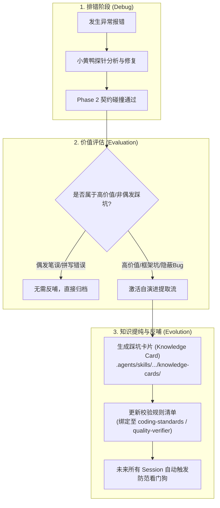

# 🔄 排错经验反哺与 Knowledge 自动演进闭环规范 (Self-Evolution & KI Protocol)

> **版本**：V1.0  
> **适用场景**：排错调试成功后的经验提纯、高价值坑点知识卡片 (Post-mortem Knowledge Card) 自动导出，以及工程规则库的自演进升级。

---

## 🏛️ 一、 自演进闭环的核心理念

大模型最大的痛点之一是 **“跨 Session 失忆”**——在一个会话中辛苦排查出某个复杂 Bug（如 Maven 传递依赖冲突、特定数据库连接池超时、ORM 类型转换踩坑），归档换到新 Session 后，Agent 会再次犯同样的错误。

本规范要求在排错成功后发起 **经验反哺自演进 (Self-Evolution)**，将一次性的排错经验转化为 **工程永久知识资产 (Project KI)**：



---

## 📋 二、 踩坑卡片 (Post-mortem Knowledge Card) 标准格式

当判定报错属于高价值问题时，自动在工程 `.agents/skills/quality-verifier/references/knowledge-cards/` 目录下生成标准复盘卡片 `postmortem-YYYYMMDD-<bug_topic>.md`：

```markdown
# 📑 踩坑复盘知识卡片 (Post-mortem Knowledge Card)

> **故障主题**：[例：Spring Boot 3 + MyBatis-Plus LocalDateTime 序列化异常]  
> **归档时间**：2026-10-06  
> **影响模块**：`apex-order-service`  

---

### 1. 🚨 故障现象 (Symptom)
- **报错堆栈**：`com.fasterxml.jackson.databind.exc.InvalidDefinitionException: Java 8 date/time type java.time.LocalDateTime not supported by default`
- **复现路径**：请求 `POST /api/v1/orders` 返回 500 错误。

### 2. 🔍 小黄鸭根因剖析 (Root Cause)
- **直接原因**：Spring Boot 3 的 Jackson 默认未注册 `JavaTimeModule`，导致包含 `LocalDateTime` 字段的 DTO 在 JSON 序列化时报空指针/定义异常。
- **深层陷阱**：在 POM 中引用了第三方 Base 依赖，盖掉了框架默认的 AutoConfiguration。

### 3. 🛡️ 永久防范看门狗规则 (Prevention Check / Rule Injection)
今后在编写包含 Date/Time 字段的代码或代码审查时，强制校验：
- [ ] 检查 `WebMvcConfigurer` 是否已统一配置 `JavaTimeModule` 及 `yyyy-MM-dd HH:mm:ss` 格式化器。
- [ ] JPA / MyBatis Entity 中强约束使用 `@JsonFormat(pattern = "yyyy-MM-dd HH:mm:ss")` 护栏。
```

---

## 🎯 三、 高价值踩坑判定标准

并非所有错误都需要导出知识卡片，严格遵循 **3 提纯 3 过滤** 原则：

### 🟢 必须提纯导出 (Must Extract)
1. **框架/依赖库隐蔽坑**：如 Maven 版本冲突、Spring Bean 循环依赖、Redis 序列化错乱。
2. **数据库/SQL 陷阱**：如 MySQL 8.0 时区偏差、ORM 软删除字段索引失效、死锁事务隔离级别。
3. **特定业务架构盲点**：如分布式 TraceID 丢失、JWT Token 跨域刷新失效。

### 🔴 严格过滤排除 (Filter Out)
1. 简单的语法拼写错误（如少写分号、变量名写错）。
2. 未启动数据库环境导致的端口未连通（已由 `preflight` 预检覆盖）。
3. 临时性的网络丢包或本地文件路径填错。

---

## 🔄 四、 联动 SOP-05 会话归档流程

在执行 `.ai/sop/05-sop-archive.md`（会话归档）时，追加 **经验提纯检查步骤**：

```markdown
### Step 2.5: 踩坑经验扫描与 KI 反哺
1. 扫描本 Session 的对话历史与小黄鸭排错记录。
2. 若存在高价值 Bug 修复，自动生成 `postmortem-*.md` 知识卡片。
3. 将卡片路径更新注册至顶层 `references/` 索引表中，实现跨 Session 记忆无损传承。
```
