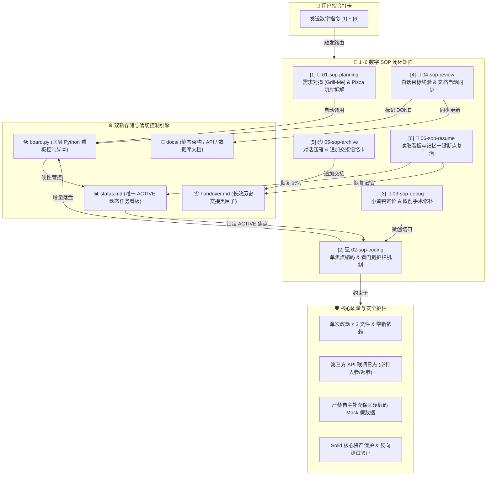

# 📖 通用项目开发工作流与归档指南 (Vibe Coding 3.0 Standard)

> **本指南整合了当前目录下 22 个 Markdown 核心资料的工程精髓**。为新项目 Vibecoding 3.0 开发与老项目 AI 破局归档提供全流程指导。

---

## 📂 1. 自动化 Base 工程目录结构 (base_template/)

在任何新项目或接入的老项目中，建议包含如下结构：

```plaintext
my-project/
├── .cursorrules               # 🧠 AI 行为约束与数字路由表 [1-6]
├── .windsurfrules             # 🧠 IDE 规则适配文件
├── .gitignore                 # 🔒 代码库过滤规约
├── .env.example               # 🔒 环境变量安全示例
├── README.md                  # 📖 项目门面与开发指引
│
├── .ai/                       # 🧠 AI 动态协作与状态控制中心
│   ├── status.md              # 📊 实时任务看板 (唯一 ACTIVE 焦点)
│   ├── handover.md            # 📦 历史交接记忆卡 (追加模式黑匣子)
│   ├── legacy_arch.md         # 🏛️ (老项目专有) 老代码模块与接口切片索引库
│   ├── scripts/
│   │   └── board.py           # 🛠️ 确定性 Python 状态控制脚本
│   ├── sop/                   # 📜 1~6 号数字 SOP 规则矩阵
│   │   ├── 01-sop-planning.md # [1] 需求拆解与 Grill-Me 对撞
│   │   ├── 02-sop-coding.md   # [2] 单焦点护栏编码 (看门狗机制)
│   │   ├── 03-sop-debug.md    # [3] 小黄鸭探针排错
│   │   ├── 04-sop-review.md   # [4] 目标终验与文档更新
│   │   └── 06-sop-resume.md   # [6] 🛟 续航重连 (一键复活)
│   └── templates/
│       └── user-manual-template.md # 软著/使用手册导出模版
│
├── docs/                      # 📁 静态工程架构与软著资产库
│   ├── 01-requirements.md     # 🗺️ 需求全景 MAP 导航中心
│   ├── 02-architecture.md     # 架构设计与模块关系图
│   ├── 03-database-design.md  # 数据库 ER 图与字典
│   ├── 04-api-design.md       # API 接口规范
│   ├── modules/               # 📦 业务模块化 PRD 文件夹
│   │   ├── auth/              # 认证模块 PRD
│   │   └── order/             # 订单模块 PRD
│   └── user-manual.md         # 产品使用手册 (软著源文件)
│
└── src/                       # 💻 真实业务源代码
```

---

## ⚡ 2. 新项目：Vibecoding 3.0 数字驱动闭环

对于新项目，只需复制 `base_template/` 中的全套文件作为脚手架，在对话框中通过敲击数字即可完成全自动开发闭环：

### 🔄 1~6 数字 SOP 开发全流程



### 💡 双轨记忆机制
- **`status.md` (当前记忆)**：存储当前的唯一 `IN_PROGRESS` 任务及 `TODO`/`DONE` 队列。
- **`handover.md` (长效记忆)**：存储每次归档时的“版本 Changelog + 架构决策”。

---

## 🏛️ 3. 老项目：追加 Base 工程与 AI 破局归档工作流

针对代码庞大、缺少文档或逻辑混杂的现有老项目，按以下 **“四步破局归档法”** 接入：

### 🛠️ 接入实施步骤

1. **追加 Base 脚手架**：
   - 将 `base_template/` 下的 `.cursorrules`、`.ai/`、`docs/` 追加拷贝到老项目根目录中。

2. **第一步：鸟瞰全局 (看骨架做减法)**
   - **操作**：向 AI 喂老项目的**前3层目录树**与**包依赖文件**（`package.json`/`pom.xml`/`go.mod`）。
   - **AI 职责**：判断技术栈架构（如 MVC、微服务、DDD）、框架版本与项目入口。

3. **第二步：建立索引与模块归档**
   - **操作**：提取 3~5 个核心主干/配置文件，命令 AI 自动生成 `docs/02-architecture.md` 以及 `.ai/legacy_arch.md`。
   - **成果**：将老项目现存的模块（认证、订单、支付等）及 API 归档入 `docs/04-api-design.md`。

4. **第三步：切片追踪与逆向考古 (攻坚晦涩代码)**
   - **单链路切片**：开发具体需求时，自顶向下（路由 ➔ 控制器 ➔ Service ➔ DAO）仅调阅该路径上的 3~4 个文件，绝不超载上下文。
   - **逆向考古**：面对“祖传山寨代码”，让 AI **逆向补全中文注释**，并**编写探针单测**锁死老代码行为后再改动。

5. **第四步：纳入 Vibecoding 迭代**
   - 将改造任务或新需求拆解为 `[Task-XXX]` 写入 `.ai/status.md`。
   - 恢复使用 `[1]-[6]` 数字 SOP 完成后续迭代开发。

---

## 🧪 4. 看板控制脚本命令参考 (`board.py`)

可以通过命令行手动验证或供 AI 静默调用：

- **查看当前看板**：`python .ai/scripts/board.py list`
- **添加新任务**：`python .ai/scripts/board.py add "Task-001" "任务标题" "白话验收目标" "涉及文件"`
- **开始任务 (ACTIVE)**：`python .ai/scripts/board.py start "Task-001"`
- **完成任务 (DONE)**：`python .ai/scripts/board.py complete "Task-001"`
- **追加交接记忆**：`python .ai/scripts/board.py archive "* 🎯 完成任务..."`

---

## 🛡️ 5. 代码质量与开发规约 (Coding Protocols)

为保证代码干净可维护、联调高效且真实反映接口状态，全体开发与 AI 协作必须严密遵循以下规约：

### 1. 🚫 禁止添加大量无意义日志
- 严禁在日常逻辑处理中铺天盖地添加 `console.log` / `print` / `logger.debug` 等无意义调试日志。
- 代码上线或交付前必须保持日志清爽。

### 2. 🔌 必须追加必要的第三方联调日志
- 在关键业务节点（**尤其是调用第三方 API 接口、外部 RPC 或异步消息服务**）时，**必须且只能记录必要的联调日志**。
- **日志标准**：必须清晰格式化输出 **请求入参 (Input Parameters)** 与 **响应返参 (Response Payload/Result)**，便于定位联调报文与对接故障。

### 3. ❌ 严禁自主补充保底测试数据
- **禁止硬编码兜底**：当第三方接口尚未调通、发生异常或返回空数据时，**严禁 AI 或开发人员自主在代码中编写写死的保底 Mock 数据 / fallback dummy 假数据**。
- **暴露真实状态**：遇到数据断裂或接口报错，必须如实抛出异常或返回真实结果，切勿通过伪造假数据掩盖真实的联调问题。

### 4. 💎 融合旧内核精华 (Sentinel Kernel v3.0 Enhancements)
- **Pizza Slicing 命名范式**：拆解 Task 时标明 `[S1-Bone 骨架/接口]`、`[S2-Muscle 业务]`、`[S3-Stub 探针]`，让架构层次更清晰。
- **Solid 核心资产保护**：触碰数据库 Schema、API 契约等核心资产时高亮预警，并在文档留痕。
- **反向验证 (Reverse Testing)**：对于核心算法与安全逻辑，支持“破坏性验证”，杜绝虚假绿灯。


