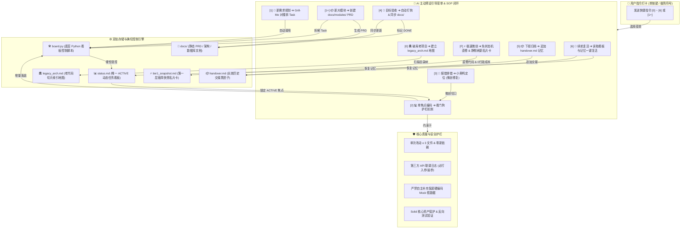
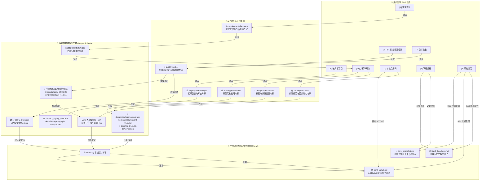

# 📖 通用项目开发工作流与归档指南 (Vibe Coding 3.0 Standard)

> **本指南整合了当前目录下 22 个 Markdown 核心资料的工程精髓**。为新项目 Vibecoding 3.0 开发与老项目 AI 破局归档提供全流程指导。

---

## 📂 1. 通用双层工作流解耦结构 (Outer Workflow Controller Paradigm)

在任何工程开发中，遵循 **“外层做工作流控制中枢，内层做纯粹业务工程”** 的解耦架构：

<!-- AUTO-TREE-FULL:START -->
```plaintext
Apex/                                       # 🚀 顶层工作区 (IDE 打开的根目录)
├── 🧩 .agents/                              # 🧩 AI 专属技能包库
│   └── 📁 skills/
│       ├── 📁 archetype-architect/          # (原型架构与模块关系梳理专家)
│       │   ├── 📖 README.md                 # 📖 项目门面与使用指南
│       │   ├── 📄 SKILL.md                  # 原型架构与模块关系梳理专家。解析静态 HTML 原型，通过反向质询 (Grill Protocol) 补全隐藏业务逻辑，按场景选配生成 Mermaid 图表并强制落盘归档。
│       │   ├── 📁 examples/
│       │   ├── 📁 references/
│       │   ├── 🛠️ scripts/                 # 🛠️ 自动化控制与分析脚本库
│       │   └── 📁 templates/                # 📁 文档与原型外壳模板
│       ├── 📁 coding-standards/             # (统一代码规范与 DLD 契约绑定专家)
│       │   ├── 📖 README.md                 # 📖 项目门面与使用指南
│       │   ├── 📄 SKILL.md                  # 统一代码规范与 DLD 契约强绑定专家。负责在代码编写阶段，强约束 AI 逐字绑定 DLD 详细设计说明书中的数据库表结构、字段名与 API 契约，并按需加载 Java 或 Vue 语言级别的分层开发规约。
│       │   └── 📁 references/
│       ├── 📁 design-spec-architect/        # 📐 Design-Spec-Architect (架构设计说明书与变更同步专家)
│       │   ├── 📖 README.md                 # 📖 项目门面与使用指南
│       │   ├── 📄 SKILL.md                  # 概要设计说明书 (HLD) 与详细设计说明书 (DLD) 自动生成与变更同步专家。基于 PRD 和原型推演系统分层、表结构、接口契约与异常流，严格遵循钧天科技 V1.0 8大章节标准，并在需求变更时增量更新架构文档。
│       │   ├── 📁 examples/
│       │   ├── 📁 references/
│       │   └── 📁 templates/                # 📁 文档与原型外壳模板
│       ├── 📁 legacy-archaeologist/         # (老项目逆向考古与代码解密专家)
│       │   ├── 📖 README.md                 # 📖 项目门面与使用指南
│       │   ├── 📄 SKILL.md                  # 老项目逆向考古与代码解密专家。负责在面对缺乏文档、代码庞杂的老项目时，自顶向下扫描路由与 Controller/Service/DAO 链路切片，逆向提取 API 契约与表结构关系，自动生成 legacy_hld.md，并编写反向行为锁死探针防止重构改崩旧业务。
│       │   ├── 📁 references/
│       │   └── 🛠️ scripts/                 # 🛠️ 自动化控制与分析脚本库
│       ├── 📁 quality-verifier/             # 🧪 Quality-Verifier (质量验证与小黄鸭排错专家)
│       │   ├── 📖 README.md                 # 📖 项目门面与使用指南
│       │   ├── 📄 SKILL.md                  # 质量验证、TDD测试用例先行与小黄鸭探针排错专家。负责在编码前根据 DLD 契约自动生成测试用例文档与自动化脚本，在编码后执行契约碰撞测试，并在运行/编译报错时激活小黄鸭探针（日志抓取➔根因分析➔最小化验证）进行精准排错。
│       │   ├── 📁 references/
│       │   └── 🛠️ scripts/                 # 🛠️ 自动化控制与分析脚本库
│       └── 📁 requirement-discovery/        # 🔍 Requirement-Discovery (AI 主导的需求发现与澄清流程)
│           ├── 📖 README.md                 # 📖 项目门面与使用指南
│           ├── 📄 SKILL.md                  # AI 主导的软件与工业系统需求发现和澄清流程。用于客户只给出一句话、模糊、不完整、口语化需求，或用户要求“分析需求、梳理需求、挖掘隐性需求、帮我问客户、把需求问清楚、像产品经理/行业专家一样澄清需求”时。先在内部展开目标、场景、异常、生命周期、上下游、数据、规模、权限与验收，再只向用户暴露真正需要其提供事实或做业务取舍的高价值问题。所有提问必须使用非技术用户能理解的白话和具体场景；区分已确认、AI 推断、暂定、待确认和潜在需求；用户不知道时给推荐默认值继续推进；需求未稳定前不得进入具体技术选型。
│           └── 📁 references/
├── 🧠 .ai/                                  # ⚙️ 统一工作流控制中心 (三层记忆金字塔)
│   ├── 🛠️ scripts/                         # 🛠️ 自动化控制与分析脚本库
│   │   ├── 📄 arch.py                       # 🏛️ 老项目拓扑图谱分析脚本
│   │   ├── 📄 board.py                      # 📊 确定性看板与任务状态控制脚本
│   │   └── 📄 sync_tree.py                  # 🔄 目录树与 Markdown 文档自动同步脚本
│   ├── 📜 sop/                              # 📜 全套 00~06 数字 SOP 规则矩阵
│   │   ├── 📄 00-sop-legacy.md              # (00-sop-legacy)
│   │   ├── 📄 01-sop-planning.md            # (01-sop-planning)
│   │   ├── 📄 02-sop-coding.md              # (02-sop-coding)
│   │   ├── 📄 03-sop-debug.md               # (03-sop-debug)
│   │   ├── 📄 03_fast-sop-fasttrack.md      # (03_fast-sop-fasttrack)
│   │   ├── 📄 04-sop-review.md              # (04-sop-review)
│   │   ├── 📄 05-sop-archive.md             # (05-sop-archive)
│   │   └── 📄 06-sop-resume.md              # (06-sop-resume)
│   ├── 📄 tier1_snapshot.md                 # [第一层：极简快照名片层] 项目动态快照 (tier1_snapshot.md) [DEMO 示例 / 样例模板]
│   ├── 📄 tier2_legacy_arch.md              # (tier2_legacy_arch.md)
│   ├── 📄 tier2_modules.md                  # [第二层：宏观业务大模块总览层] 大模块矩阵索引表 (tier2_modules.md) [DEMO 示例 / 样例模板]
│   ├── 📄 tier3_handover.md                 # [第三层：微观原子任务层] 历史交接黑匣子 (tier3_handover.md) [DEMO 示例 / 样例模板]
│   └── 📄 tier3_status.md                   # 📋 [第三层：微观原子任务层] 实时任务看板 (tier3_status.md) [DEMO 示例 / 样例模板]
├── 🧠 .cursorrules                          # 🧠 AI 行为约束与数字路由表
├── 🧠 .windsurfrules                        # 🧠 IDE 规则适配文件
├── 📖 README.md                             # 📖 项目门面与使用指南
├── 📖 WORKFLOW_GUIDE.md                     # 📖 完整工作流与设计指南
├── 💻 base_template/                        # [业务项目名称 / Project Name]
│   ├── 🧩 .agents/                          # 🧩 AI 专属技能包库
│   │   └── 📁 skills/
│   │       └── 📁 requirement-discovery/
│   ├── 🧠 .cursorrules                      # 🧠 AI 行为约束与数字路由表
│   ├── 🧠 .windsurfrules                    # 🧠 IDE 规则适配文件
│   ├── 📖 README.md                         # 📖 项目门面与使用指南
│   └── 📁 docs/                             # 📁 本工程 PRD / 架构 / 设计文档
│       ├── 📄 01-requirements.md            # 🗺️ 01 - 业务需求全景地图与 PRD 导航中心 (Requirements Master MAP)
│       ├── 📄 02-architecture.md            # 🏛️ 02 - 概要设计与系统架构图
│       ├── 📄 03-database-design.md         # 🗄️ 03 - 数据库设计与 ER 关系规约
│       ├── 📄 04-api-design.md              # 🌐 04 - API 接口详细设计规范
│       ├── 📄 05-known-limitations.md       # (Workflow Defect & Improvement Board)
│       ├── 📄 06-legacy-graph-analysis.md   # 🕸️ 老项目路由元数据拆解与关系图谱分析指南 (Legacy Metadata Graph Analysis Guide)
│       ├── 📁 db/
│       │   ├── 📄 base.sql
│       │   ├── 📁 migrations/               # 🗄️ 增量业务 SQL 演进目录 (db/migrations)
│       │   └── 📄 service.sql
│       ├── 🎨 design/                       # /UX 设计规范与主题资产库 (Design Assets Directory)
│       │   ├── 📖 README.md                 # 📖 项目门面与使用指南
│       │   └── 📄 design-tokens.md          # (Design System Tokens)
│       ├── 📦 modules/                      # (Modules Directory)
│       │   ├── 📖 README.md                 # 📖 项目门面与使用指南
│       │   ├── 📁 auth/
│       │   └── 📁 order/
│       ├── 📁 templates/                    # 📁 文档与原型外壳模板库 (Templates Directory)
│       │   ├── 📖 README.md                 # 📖 项目门面与使用指南
│       │   ├── 📄 base-shell-template.html
│       │   └── 📄 user-manual-template.md   # [项目名称] 产品使用手册与软著说明书
│       └── 📄 user-manual.md                # (软著申报参考)
├── 🛠️ scripts/                             # 🛠️ 自动化控制与分析脚本库
│   └── 📁 tests/
├── 📄 workflow_guide.html
└── 📄 工作流问题待办.md                            # 📋 Apex 工作流问题诊断与优化待办清单 (Workflow Issue & Action Plan)
```
<!-- AUTO-TREE-FULL:END -->

---

## ⚡ 2. 新项目：Vibecoding 3.0 数字驱动闭环

对于新项目，只需复制 `base_template/` 中的全套文件作为脚手架，在对话框中通过敲击数字即可完成全自动开发闭环：

### 🔄 1~6 数字 SOP 开发全流程


```mermaid
graph TD
    subgraph U["👤 用户指令打卡 (单按键 / 极简符号)"]
        INPUT["发送快捷指令 [0] ~ [6] 或 [1+]"]
    end

    subgraph MENU["🤖 AI 主动预设引导菜单 & SOP 闭环"]
        M0["[0] 🏛️ 破局老项目 ➔ 建立 legacy_arch.md 地图"]
        M1["[1] 🎯 新需求规划 ➔ Grill-Me 对撞拆 Task"]
        M1P["[1+] 📦 新大模块 ➔ 创建 docs/modules/ PRD"]
        M2["[2] 💻 单焦点编码 ➔ 看门狗护栏机制"]
        M3["[3] 🐞 报错排错 ➔ 小黄鸭定位 (微创修复)"]
        MFAST["[F] ⚡ 极速微创 ➔ 免状态机直修 & 静默刷新名片卡"]
        M4["[4] 🏁 目标验收 ➔ 自动打钩 & 同步 docs/"]
        M5["[5] 📦 下班归档 ➔ 追加 handover.md 记忆"]
        M6["[6] 🛟 续航复活 ➔ 读取看板与记忆一键复活"]
    end

    subgraph RULES["🛡️ 核心质量与安全护栏"]
        R1["单次改动 ≤ 3 文件 & 零新依赖"]
        R2["第三方 API 联调日志 (必打入参/返参)"]
        R3["严禁自主补充保底硬编码 Mock 假数据"]
        R4["Solid 核心资产保护 & 反向测试验证"]
    end

    subgraph ENGINE["⚙️ 双轨存储与确切控制引擎"]
        PY["🛠️ board.py (底层 Python 看板控制脚本)"]
        ST["📊 status.md (唯一 ACTIVE 动态任务看板)"]
        SN["⚡ tier1_snapshot.md (第一层极简快照名片卡)"]
        HO["📦 handover.md (长效历史交接黑匣子)"]
        LEG["🏛️ legacy_arch.md (老代码切片索引地图)"]
        DOC["📁 docs/ (静态 PRD / 架构 / 数据库文档)"]
    end

    INPUT -->|选择菜单| MENU
    M0 -->|扫描目录树| LEG
    M1 -->|自动调用| PY
    M1P -->|生成 PRD| DOC
    M1P -->|拆解 Task| PY
    M2 -->|约束于| RULES
    M2 -->|增量落盘| PY
    M3 -->|微创切口| M2
    MFAST -->|直修代码 & 0行政成本| SN
    M4 -->|标记 DONE| PY
    M4 -->|同步更新| DOC
    M5 -->|追加交接| HO
    M6 -->|恢复记忆| ST & HO

    PY -->|硬性管控| ST
    ST -->|锁定 ACTIVE 焦点| M2
```


### 💡 三层记忆金字塔架构 (3-Tier Memory Architecture)
为解决长期开发中大模型上下文膨胀 (BUG-003) 缺陷，工作流建立并物理标注了三层立体的记忆与掌控模型：

1. **⚡ 第一层：动态极简快照名片 (`.ai/tier1_snapshot.md`)**
   - **物理标识**：前缀 `tier1_`，文件顶部带 `【三层记忆金字塔 - 第一层】` 明确头注释。
   - **特点**：永远硬性物理死锁在 30 行以内（<500 Token），包含项目概况、已稳固里程碑（最多3行）、当前唯一 ACTIVE 焦点及顶层铁律。
   - **使用**：每次敲击 **`6`** 断点复活时，AI **优先且只读取本文件**，实现 0.5 秒极速吃透工程并彻底封死 Token 膨胀。
2. **🧩 第二层：宏观业务大模块总览地图 (`.ai/tier2_modules.md` & `docs/modules/`)**
   - **物理标识**：前缀 `tier2_`，总览表与 `tier3_handover.md` 同级放在 `.ai/` 统一控制中心。老代码切片为 `tier2_legacy_arch.md`。
   - **确定性产出物**：输入 **`1+ 模块名`** 时，在 `docs/modules/<module_name>/` 下生成静态 PRD 与 **🖥️ 可交互 HTML 线框原型 (`mockup.html`)**。
   - **UI 布局统一锁死规约**：AI 生成原型时**必须强制继承 `docs/templates/base-shell-template.html` 的结构外壳**（顶部 Header + 左侧 Sidebar 导航），绝对禁止自作主张修改 App 大布局，AI 仅填充主内容区域，保证所有模块 100% 风格布局统一！
   - **使用**：防范 AI 与团队“只见树木不见森林”，作为需求评审 Sign-off 的物理交互依据。


3. **📦 第三层：微观原子任务流水账 (`.ai/tier3_status.md` & `.ai/tier3_handover.md`)**
   - **物理标识**：前缀 `tier3_`，看现在与未来的任务看板为 `tier3_status.md`，看过去历史交接黑匣子为 `tier3_handover.md`。
   - **特点**：记录每一个 Task-XXX 的增量代码改动、改错与版本 Changelog。
   - **使用**：输入 **`5`** 归档下班时追加备份到 `tier3_handover.md` 并更新 `tier1_snapshot.md`。


---

## 🏛️ 3. 老项目：追加 Base 工程与 AI 破局归档工作流

针对代码庞大、缺少文档或逻辑混杂的现有老项目，按以下 **“四步破局归档法”** 接入：

### 🛠️ 接入实施步骤

1. **追加 Base 脚手架**：
   - 将 `base_template/` 下的 `.cursorrules`、`.ai/`、`docs/` 追加拷贝到老项目根目录中。

2. **第一步：鸟瞰全局 (看骨架做减法)**
   - **操作**：向 AI 喂老项目的**前3层目录树**与**包依赖文件**（`package.json`/`pom.xml`/`go.mod`）。
   - **AI 职责**：判断技术栈架构（如 MVC、微服务、DDD）、框架版本与项目入口。

3. **第二步：路由切入 ➔ 4D 元数据提取 ➔ 自动拓扑关联**
   - **操作**：输入前端路由入口（如 `/order/create`），运行 `python .ai/scripts/arch.py analyze` 提取路由、文件、API、表名。
   - **成果**：自动落盘注册入 `.ai/tier2_legacy_arch.md`（元数据池），并自动计算模块交集生成 Mermaid 可视化关系图谱（详见 [docs/06-legacy-graph-analysis.md](file:///Users/up_dong/Documents/%E8%B5%B5%E6%8C%AF%E4%B8%9C%E7%A7%81%E6%9C%89/energy_carbon/docs/06-legacy-graph-analysis.md)）。

4. **第三步：深层搜寻与单链路切片修改**
   - **深层搜寻**：遇到深层嵌套文件时运行 `python .ai/scripts/arch.py find "keyword"` 穿透层级寻找。
   - **单链路切片**：开发具体需求时自顶向下仅调阅该链路文件，绝不超载上下文。

5. **第四步：纳入 Vibecoding 迭代**
   - 将改造任务或新需求拆解为 `[Task-XXX]` 写入 `.ai/status.md`。
   - 恢复使用 `[1]-[6]` 数字 SOP 完成后续迭代开发。

---

## 🧪 4. 看板控制脚本命令参考 (`board.py`)

可以通过命令行手动验证或供 AI 静默调用：

- **查看当前看板**：`python .ai/scripts/board.py list`
- **添加新任务**：`python .ai/scripts/board.py add "Task-001" "任务标题" "白话验收目标" "涉及文件"`
- **开始任务 (ACTIVE)**：`python .ai/scripts/board.py start "Task-001"`
- **完成任务 (DONE)**：`python .ai/scripts/board.py complete "Task-001"`
- **追加交接记忆**：`python .ai/scripts/board.py archive "* 🎯 完成任务..."`

---

## 🛡️ 5. 代码质量与开发规约 (Coding Protocols)

为保证代码干净可维护、联调高效且真实反映接口状态，全体开发与 AI 协作必须严密遵循以下规约：

### 1. 🚫 禁止添加大量无意义日志
- 严禁在日常逻辑处理中铺天盖地添加 `console.log` / `print` / `logger.debug` 等无意义调试日志。
- 代码上线或交付前必须保持日志清爽。

### 2. 🔌 必须追加必要的第三方联调日志
- 在关键业务节点（**尤其是调用第三方 API 接口、外部 RPC 或异步消息服务**）时，**必须且只能记录必要的联调日志**。
- **日志标准**：必须清晰格式化输出 **请求入参 (Input Parameters)** 与 **响应返参 (Response Payload/Result)**，便于定位联调报文与对接故障。

### 3. ❌ 严禁自主补充保底测试数据
- **禁止硬编码兜底**：当第三方接口尚未调通、发生异常或返回空数据时，**严禁 AI 或开发人员自主在代码中编写写死的保底 Mock 数据 / fallback dummy 假数据**。
- **暴露真实状态**：遇到数据断裂或接口报错，必须如实抛出异常或返回真实结果，切勿通过伪造假数据掩盖真实的联调问题。

### 4. 💎 融合旧内核精华 (Sentinel Kernel v3.0 Enhancements)
- **Pizza Slicing 命名范式**：拆解 Task 时标明 `[S1-Bone 骨架/接口]`、`[S2-Muscle 业务]`、`[S3-Stub 探针]`，让架构层次更清晰。
- **Solid 核心资产保护**：触碰数据库 Schema、API 契约等核心资产时高亮预警，并在文档留痕。
- **反向验证 (Reverse Testing)**：对于核心算法与安全逻辑，支持“破坏性验证”，杜绝虚假绿灯。

---

## 🚀 6. 两大核心场景实战操作资产指南 (Scenario Operating Manual)

### 🌟 场景一：从 0 到 1 新项目极速开发全流程

```plaintext
【第1步: 建文件夹】解压脚手架 ➔ 【第2步: 输入 1+】创建 PRD 拆 Task ➔ 【第3步: 输入 2】写骨架与业务
                                                                            │
【第6步: 输入 6】第二天复活续航 🔑 【第5步: 输入 5】打包交接记忆 🔑 【第4步: 验证 3/4】排错/验收闭环
```

1. **第一阶段：创建与大规划**
   - 新建文件夹并解压 Base 脚手架。
   - 输入 `1+ 模块名`（如：`1+ 权限模块`）➔ AI 自动在 `docs/modules/` 下生成标准 PRD 文档 ➔ 抛出 A/B/C 选择题对撞。
2. **第二阶段：Pizza 切片与单焦点编码**
   - 需求自动拆解为 `[Task-001]` (S1-Bone 骨架) 与 `[Task-002]` (S2-Muscle 业务)，自动调用 `board.py` 落盘看板。
   - 输入 `2` ➔ 开启看门狗护栏（单次≤3文件、零新依赖、真实数据原则），AI 增量写代码落盘，生成白话验证 Checklist。
3. **第三阶段：验证与排错闭环**
   - 报错或效果不对 ➔ 输入 `3` 附截图，触发小黄鸭微创修复（只动错的那 1 行）。
   - 测试满意 ➔ 输入 `4` 验收打钩 🟢，AI 静默更新 `docs/` 并自动推荐下一个 Task。
4. **第四阶段：下班归档与新窗口复活**
   - 下班输入 `5` ➔ 压缩 Changelog 追加到 `.ai/handover.md` 长效黑匣子。
   - 重新开新窗口输入 `6` ➔ AI 读取看板和黑匣子自动“一键复活断点记忆”，直接提示发 `2` 继续！

---

### 🏛️ 场景二：老项目“四阶段渐进式”破局与改造工作流

> ⚠️ **老项目铁律**：老项目工程庞大、逻辑复杂，**绝对无法也严禁尝试“一次性全量扫描”或“一次性重构完”**。必须遵循分阶段、探雾式渐进推进！

```plaintext
【第1阶段: 骨架鸟瞰】输入 0 (仅第1天执行1次) ➔ 【第2阶段: 黑盒解密】路由/表名搜索 ➔ 【第3阶段: 切片改动】单链路修改
                                                                                            │
【第二天及未来所有日子】➔ 打开新窗口 ➔ 直接输入 6 (一键复活) ➔ 输入 2 接着写代码！ ◄──────────────┘
```

1. **第 1 阶段：骨架鸟瞰（仅第 1 天执行 1 次！）**
   - 将脚手架拷贝进老项目，输入 `0` 或 `0，只扫前3层目录树和 package.json/pom.xml`。
   - AI 10 秒抓出顶层骨架，自动生成 `.ai/legacy_arch.md` 切片地图。（**建立完地图后，以后再也不用输入 `0`**）。
2. **第 2 阶段：黑盒解密（当不知道文件夹业务时）**
   - **招式 A (路由逆向追踪)**：`0，顺着接口 /api/refund 帮我找关联文件更新 legacy_arch.md`
   - **招式 B (表名/关键词搜索)**：`0，全局搜索表名 t_order_refund，找出负责的文件夹`
   - **招式 C (AI 探查菜单)**：`0，扫前2层，列出 A/B/C 业务模块菜单告诉我`
3. **第 3 阶段：单链路切片修改与防腐护栏**
   - 输入 `1` 拆解特定小需求 ➔ 输入 `2` 开启编码。
   - **防腐护栏**：AI 每次仅调阅关联的 3 个老文件，绝对不许顺手重构无辜老代码。
4. **第 4 阶段：归档与二次复活**
   - 下班输入 `5` 归档。第二天/未来任何新窗口开启时，**直接输入 `6` 即可一键恢复记忆**！

---

## ⚠️ 7. 缺陷与改进追溯看板 (Workflow Defect & Improvement Board)

为了保持工程落地的客观严谨，本项目建立了可动态更新状态的 [docs/05-known-limitations.md](file:///Users/up_dong/Documents/%E8%B5%B5%E6%8C%AF%E4%B8%9C%E7%A7%81%E6%9C%89/energy_carbon/docs/05-known-limitations.md) 缺陷追溯看板（包含 🔴 OPEN / 🟡 IN_PROGRESS / 🟢 RESOLVED 状态标记）：
1. **[BUG-001] 多人 Git Merge 冲突问题** ➔ 🔴 待解决 (OPEN)
2. **[BUG-002] 缺乏强制自动化测试门禁** ➔ 🟡 优化中 (IN_PROGRESS)
3. **[BUG-003] 记忆黑匣子 Token 膨胀** ➔ 🟢 已解决 (RESOLVED: 上线三层记忆金字塔架构)
4. **[BUG-004] 缺乏老项目专属 SOP 与自动化扫描脚本** ➔ 🟢 已解决 (RESOLVED: 已上线 00-sop-legacy 与 arch.py)
5. **[BUG-005] 缺少极简打卡与 AI 主动引导菜单** ➔ 🟢 已解决 (RESOLVED: 已上线 0/1/1+ 快捷菜单)
6. **[BUG-006] 仪式感过载与 Vibe 阻尼效应** ➔ 🟢 已解决 (RESOLVED: 已上线 03_fast-sop-fasttrack 与 [F] 极速路由)


---

## 🧩 8. 工作流全阶段、Skill 绑定映射与输出产物字典 (Workflow & Skill Output Spec)

为确保 AI 与开发人员在协同过程中产出明确、结构化的工程资产，本项目将 **数字 SOP 阶段**、**AI 专属 Skill 技能包**、**核心动作**与**物理输出产物 (Output Artifacts)** 进行了 100% 绑定。

### 🔄 全流程架构节点与物理产物流转图 (Mermaid Topology)


```mermaid
graph TD
    subgraph INPUT["👤 用户数字 SOP 指令"]
        N0["[0] 破局老项目"]
        N1["[1] 需求规划"]
        N1P["[1+] 大模块规划"]
        N2["[2] 单焦点编码"]
        N3["[3] / [F] 报错/极速修补"]
        N4["[4] 目标验收"]
        N5["[5] 下班归档"]
        N6["[6] 续航复活"]
    end

    subgraph SKILLS["🧩 AI 专属 Skill 技能包"]
        S0["🏛️ legacy-archaeologist<br/>老项目逆向考古专家"]
        S1["🔍 requirement-discovery<br/>需求发现与白话澄清专家"]
        S1P1["🏛️ archetype-architect<br/>原型架构梳理专家"]
        S1P2["📐 design-spec-architect<br/>概要与详细设计专家"]
        S2["💻 coding-standards<br/>代码规范与契约绑定专家"]
        S3["🧪 quality-verifier<br/>质量验证与小黄鸭排错专家"]
    end

    subgraph CONTROL["🧠 工作流状态与记忆控制中枢 (.ai/)"]
        BP["🛠️ board.py 看板控制脚本"]
        T1["⚡ tier1_snapshot.md<br/>极简快照名片卡 (<30行)"]
        T3S["📋 tier3_status.md<br/>ACTIVE/DONE 任务看板"]
        T3H["📦 tier3_handover.md<br/>长效历史交接黑匣子"]
    end

    subgraph ARTIFACTS["📄 确定性物理输出产物 (Output Artifacts)"]
        A0["🏛️ .ai/tier2_legacy_arch.md<br/>docs/06-legacy-graph-analysis.md"]
        A1["📝 结构化需求基线草稿<br/>白话对撞决策列表"]
        A1P["🎨 docs/modules/<mod>/mockup.html<br/>📄 docs/modules/<mod>/prd-v1.0.md<br/>📐 docs/01~04.md & db/service.sql"]
        A2["💻 业务工程源码 (src/)<br/>🔌 第三方 API 联调日志"]
        A3["🐞 小黄鸭根因分析诊断报告<br/>🧪 scripts/tests/ 测试脚本<br/>🔧 微创修补代码 (1~2行)"]
        A4["🟢 白话验证 Checklist<br/>同步更新静态 docs/"]
    end

    %% 指向与流转
    N0 -->|激活| S0 -->|生成| A0
    N1 -->|激活| S1 -->|输出| A1
    A1 -->|驱动| N1P
    N1P -->|激活| S1P1 & S1P2
    S1P1 & S1P2 -->|生成| A1P
    A1P -->|注册 Task| BP -->|更新| T3S

    N2 -->|锁定 ACTIVE| T3S
    N2 -->|激活| S2 -->|产出| A2
    A2 -->|状态变更| BP

    N3 -->|触发| S3 -->|生成诊断| A3
    A3 -->|微创修复| A2

    N4 -->|激活| S3 -->|测试验收| A4
    A4 -->|标记 DONE| BP -->|更新| T3S

    N5 -->|压缩追加| T3H
    N5 -->|更新快照| T1

    N6 -->|0.5s 吃透复活| T1 & T3S & T3H
```

---

### 📊 1. 工作流 SOP 与 Skill 绑定映射全景表


| 阶段 / 数字指令 | 对应 SOP 文件 | 强绑定的专属 Skill | 触发场景 / 核心职责 | 核心输出物理产物 (Output Artifacts) |
| :--- | :--- | :--- | :--- | :--- |
| **`[0]` 破局老项目** | `00-sop-legacy.md` | `legacy-archaeologist` | 老代码解密、目录树扫描、4D元数据提取与路由切片关联 | - `.ai/tier2_legacy_arch.md` (元数据地图)<br>- `docs/06-legacy-graph-analysis.md` (Mermaid 拓扑图谱)<br>- 业务反向测试验证探针 |
| **`[1]` 需求规划** | `01-sop-planning.md` | `requirement-discovery` | 模糊需求挖掘与白话澄清，展开 8-13 维隐性业务推演 | - 结构化需求基线草案<br>- 收敛的业务规则与边界约束 |
| **`[1+]` 大模块规划** | `01-sop-planning.md` | `archetype-architect`<br>`design-spec-architect` | 解析原型、Grill 盲区对撞、生成交互原型与 8 大章节 HLD/DLD | - `docs/modules/<mod>/mockup.html` (线框原型)<br>- `docs/modules/<mod>/prd-v1.0.md` (模块 PRD)<br>- `docs/01-04.md` (系统架构/数据库/API设计)<br>- `docs/db/service.sql` (增量 SQL 脚本) |
| **`[2]` 单焦点编码** | `02-sop-coding.md` | `coding-standards` | 强约束 DLD 契约绑定，触发看门狗护栏（最小改动、真日志、无假Mock） | - 业务工程源码 (`src/` Controller/Service/DAO/Vue等)<br>- 第三方联调日志 (带 Request/Response 明细)<br>- `.ai/tier3_status.md` (任务标记为 ACTIVE/DONE) |
| **`[3]` 报错排错** | `03-sop-debug.md` | `quality-verifier` | 激活小黄鸭探针（日志抓取 ➔ 根因分析 ➔ 最小化微创修复） | - 小黄鸭根因分析诊断报告<br>- 最小化代码修复切口 (1~2 行微创)<br>- 错误日志追踪记录 |
| **`[F]` 极速修补** | `03_fast-sop-fasttrack.md` | `quality-verifier` | 免 board.py 行政审批的极速代码微创直修 | - 直修源码<br>- `.ai/tier1_snapshot.md` (静默刷新名片卡) |
| **`[4]` 目标验收** | `04-sop-review.md` | `quality-verifier` | TDD 契约碰撞测试，白话目标终验，更新静态文档 | - 白话验证 Checklist & 契约碰撞报告<br>- `docs/` 联动更新<br>- `.ai/tier3_status.md` (任务标记为 DONE) |
| **`[5]` 下班归档** | `05-sop-archive.md` | - | 对话压缩落盘，长效记忆追加 | - `.ai/tier3_handover.md` (追加历史黑匣子)<br>- `.ai/tier1_snapshot.md` (更新 30 行快照名片) |
| **`[6]` 续航复活** | `06-sop-resume.md` | - | 新窗口上下文恢复，0.5s 读取极简名片卡 | - 会话断点复活提示 (告知当前 ACTIVE Task) |

---

### 📦 2. 全套 6 大 Skill 技能包职责与产物明细

#### 1. 🔍 `requirement-discovery` (需求发现与白话澄清专家)
- **触发条件**：用户发送口语化、一句话、模糊需求，或执行 `[1]` 需求规划阶段。
- **输入**：用户的一句话需求、现场模糊描述。
- **输出产物**：
  - 结构化需求基线草案（包含“已确认”、“AI推断”、“暂定”、“待确认”、“潜在需求” 5 大状态模型）。
  - 带 A/B/C 推荐选项的白话对撞问题（每轮仅暴露 1 个最高价值业务问题）。

#### 2. 🏛️ `archetype-architect` (原型架构与模块关系梳理专家)
- **触发条件**：用户发送 HTML 原型、执行 `[1+]` 大模块规划或需要梳理 UI 交互与流程。
- **输入**：静态 HTML 原型或线框图、模块业务需求。
- **输出产物**：
  - **`docs/modules/<module_name>/mockup.html`**：继承 `base-shell-template.html` 外壳的高保真交互原型。
  - **`docs/modules/<module_name>/prd-<module_name>-v1.0.md`**：包含 Mermaid 时序图/状态图/泳道图的模块 PRD。
  - **`.ai/tier2_modules.md`**：大模块矩阵注册表更新项。

#### 3. 📐 `design-spec-architect` (概要设计 HLD 与详细设计 DLD 自动生成与变更同步专家)
- **触发条件**：需求 Sign-off 进入系统设计阶段、数据库表结构变动或 API 契约变更。
- **输入**：PRD 文档、模块交互原型。
- **输出产物**：
  - **`docs/01-requirements.md`**：业务需求全景地图与 PRD 导航中心。
  - **`docs/02-architecture.md`**：概要设计与系统分层架构图。
  - **`docs/03-database-design.md`**：数据库设计与 ER 关系规约。
  - **`docs/04-api-design.md`**：API 接口详细设计与 RESTful 契约规范。
  - **`docs/db/service.sql`** / **`docs/db/migrations/`**：DDL 建表与变更 SQL 脚本。

#### 4. 💻 `coding-standards` (统一代码规范与 DLD 契约强绑定专家)
- **触发条件**：执行 `[2]` 单焦点编码阶段。
- **输入**：`.ai/tier3_status.md` 中唯一的 `ACTIVE` Task、DLD 接口与数据库契约。
- **输出产物**：
  - **工程业务代码**：Controller、Service、DAO/Mapper、前端页面与组件代码。
  - **第三方联调日志**：包含入参 (Input Parameters) 与返参 (Response Payload) 的可追溯日志。
  - **看门狗遵从记录**：无硬编码 Mock 假数据、改动范围最小化的干净提交。

#### 5. 🧪 `quality-verifier` (质量验证与小黄鸭排错专家)
- **触发条件**：执行 `[3]` 报错排错、`[F]` 极速修补或 `[4]` 目标验收阶段。
- **输入**：编译/运行错误日志、功能验收 Checklist。
- **输出产物**：
  - **小黄鸭排错报告**：日志抓取 ➔ 根因分析 ➔ 最小切口方案。
  - **微创修复代码**：精准修复引发 BUG 的单行/单文件代码，绝无蔓延副作用。
  - **`scripts/tests/`**：自动化测试用例与 TDD 契约碰撞脚本。
  - **白话验证 Checklist**：提供给用户的可手动验证条目清单。

#### 6. 🏛️ `legacy-archaeologist` (老项目逆向考古与代码解密专家)
- **触发条件**：执行 `[0]` 破局老项目，或对未接管的老代码进行逆向剖析。
- **输入**：老项目根目录树、包管理文件（`package.json`/`pom.xml`）、前端/后端路由入口。
- **输出产物**：
  - **`.ai/tier2_legacy_arch.md`**：老项目切片索引地图（包含 4D 元数据：路由、文件、API、表名）。
  - **`docs/06-legacy-graph-analysis.md`**：路由与数据流交集拓扑 Mermaid 关系图谱。
  - **反向锁死测试探针**：保护既有老业务逻辑不被重构破坏的安全垫。


