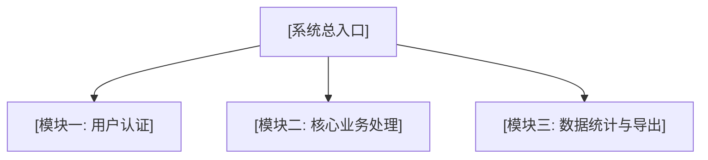

# 📖 [项目名称] 产品使用手册与软著说明书

## 1. 系统概述
- **软件名称**：[系统名称]
- **系统版本**：v1.0.0
- **运行环境**：Chrome / Edge / Node.js / Docker
- **核心定位**：[一句话说明软件解决的主要业务需求]

## 2. 系统功能架构

## 3. 主要功能操作指引

### 3.1 用户登录与权限验证
1. 打开系统首页，输入账号与密码。
2. 点击“登录”按钮，系统校验权限后进入控制台。

### 3.2 核心业务流程
1. [步骤一描述]
2. [步骤二描述]
3. [步骤三描述]

## 4. 接口与数据交互说明
- 本系统采用 RESTful API 架构，数据交互统一为 JSON 格式。
