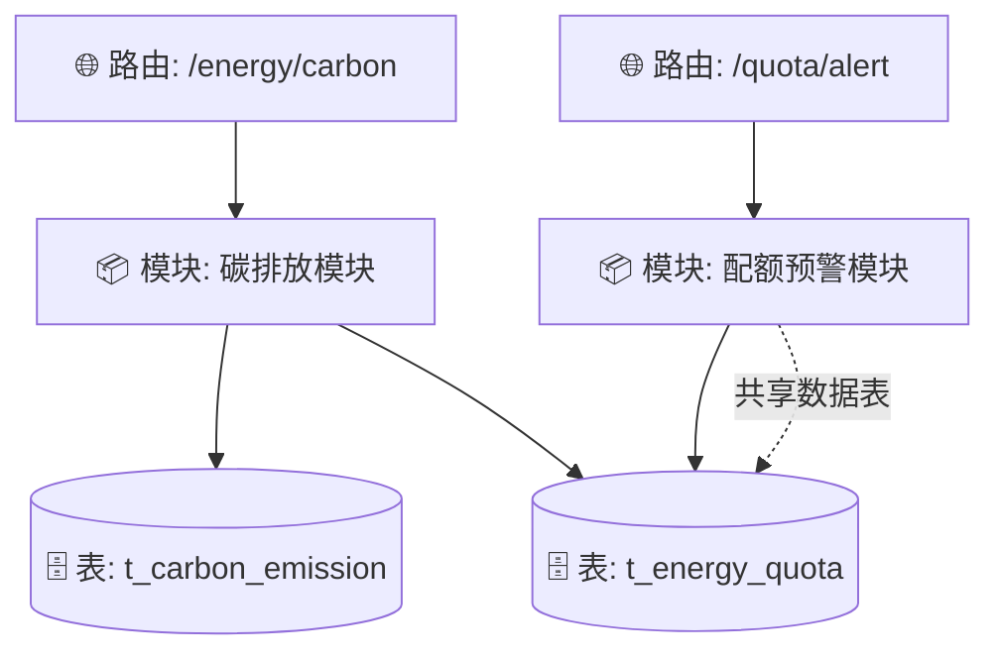

# 🏛️ 老项目模块切片与关系图谱元数据池 (tier2_legacy_arch.md)

> 💡 **本文件为老项目解密的核心产出物**。上半部分为自动绘制的可视化关系图谱，下半部分为结构化的模块元数据解密档案库。

---

## 🕸️ 全局拓扑关系图谱 (Global Topology Graph)

---

## 🧩 模块元数据注册池 (Metadata Pool)

### 🧩 模块: 碳排放模块
- **路由入口**: `/energy/carbon`
- **关键文件**: `CarbonService.java, CarbonCalc.vue`
- **绑定 API**: `POST /api/carbon/calc`
- **关联数据表**: `t_carbon_emission, t_energy_quota`

### 🧩 模块: 配额预警模块
- **路由入口**: `/quota/alert`
- **关键文件**: `AlertService.java, QuotaAlert.vue`
- **绑定 API**: `GET /api/quota/alert`
- **关联数据表**: `t_energy_quota`
- **🔗 检测到跨模块共享连接**:
  - 与 `[碳排放模块]` 共享数据表 `t_energy_quota`
