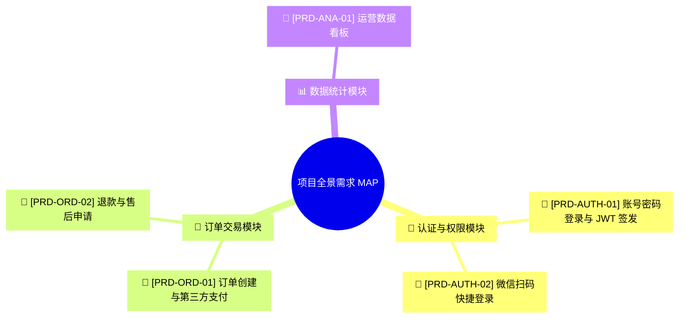

# 🗺️ 01 - 业务需求全景地图与 PRD 导航中心 (Requirements Master MAP)

> [!NOTE]
> ⚠️ **【参考示例模板说明】**：本文件为 Base 工程脚手架预置的需求地图格式范例与规范示例。实际项目开发时，请根据真实项目的业务模块对本 MAP 拓扑图与索引表进行修改填充。

> 本文档是整个项目的**需求全景总导航地图**。通过“模块可视化拓扑”与“模块矩阵表”，快速检索各业务模块下的具体 PRD 文件。

---

## 🧭 1. 模块化需求可视化思维地图 (Mindmap Visual Navigation)

---

## 📊 2. 业务模块矩阵表与 PRD 文件索引 (Module PRD Index Table)

| 业务模块名称 | 模块目录 | 核心 PRD 关联文件 | 关联需求 ID | 当前开发状态 | 责任 PM |
| :--- | :--- | :--- | :--- | :--- | :--- |
| **🔐 认证与权限** | `docs/modules/auth/` | 📄 [prd-auth-v1.md](file:///Users/up_dong/Documents/赵振东私有/AI编程重点资料/base_template/docs/modules/auth/prd-auth-v1.md) | `FR-01` | `- [/]` 进行中 | 张产品 |
| **🛒 订单交易** | `docs/modules/order/` | 📄 [prd-order-v1.md](file:///Users/up_dong/Documents/赵振东私有/AI编程重点资料/base_template/docs/modules/order/prd-order-v1.md) | `FR-02` | `- [ ]` 待开发 | 李产品 |
| **📊 数据统计** | `docs/modules/analytics/`| 📄 `prd-analytics-v1.md` | `FR-03` | `- [ ]` 待开发 | 王产品 |

---

## 🔴 3. 全局迭代需求池 (Active PRD Backlog)

> 💡 **需求状态说明**：`- [ ]` 待规划/待开发 | `- [/]` 进行中 | `- [x]` 已验收归档

- [/] **FR-01 [模块: auth]**：账号密码登录与 JWT Token 签发 ➔ 对应 [prd-auth-v1.md](file:///Users/up_dong/Documents/赵振东私有/AI编程重点资料/base_template/docs/modules/auth/prd-auth-v1.md)
- [ ] **FR-02 [模块: order]**：订单提交与第三方支付接入 ➔ 对应 [prd-order-v1.md](file:///Users/up_dong/Documents/赵振东私有/AI编程重点资料/base_template/docs/modules/order/prd-order-v1.md)

---

## 📦 4. 已归档需求与历史版本快照 (Archived Requirements)

| 需求编号 | 需求名称 | 所属模块 | 归档版本 / Milestone | 归档日期 | 验证状态 |
| :--- | :--- | :--- | :--- | :--- | :--- |
| **FR-00** | 基础工程脚手架搭建 | 核心工程 | v1.0.0-alpha | 2026-07-25 | 🟢 已归档 |
