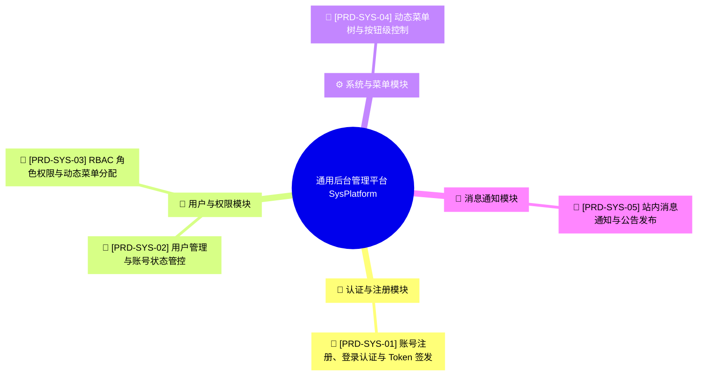

# 🗺️ 01 - 业务需求全景地图与 PRD 导航中心 (Requirements Master MAP)

> [!NOTE]
> ⚠️ **【参考示例模板说明】**：本文件为 Base 工程脚手架预置的需求地图格式范例与规范示例。实际项目开发时，请根据真实项目的业务模块对本 MAP 拓扑图与索引表进行修改填充。

> 本文档是整个项目的**需求全景总导航地图**。通过“模块可视化拓扑”与“模块矩阵表”，快速检索各业务模块下的具体 PRD 文件。

---

## 🧭 1. 模块化需求可视化思维地图 (Mindmap Visual Navigation)

```mermaid
mindmap
  root((通用后台管理平台 SysPlatform))
    auth[🔐 认证与注册模块]
      prd_sys_01["📄 [PRD-SYS-01] 账号注册、登录认证与 Token 签发"]
    user_role[👤 用户与权限模块]
      prd_sys_02["📄 [PRD-SYS-02] 用户管理与账号状态管控"]
      prd_sys_03["📄 [PRD-SYS-03] RBAC 角色权限与动态菜单分配"]
    system_menu[⚙️ 系统与菜单模块]
      prd_sys_04["📄 [PRD-SYS-04] 动态菜单树与按钮级控制"]
    notify[🔔 消息通知模块]
      prd_sys_05["📄 [PRD-SYS-05] 站内消息通知与公告发布"]
```

---

## 📊 2. 业务模块矩阵表与 PRD 文件索引 (Module PRD Index Table)

| 业务模块名称 | 模块目录 | 核心 PRD 关联文件 | 关联需求 ID | 当前开发状态 | 责任 PM |
| :--- | :--- | :--- | :--- | :--- | :--- |
| **🔐 认证与注册** | `docs/modules/sys_auth/` | 📄 `prd-sys-auth-v1.md` | `FR-SYS-01` | `- [/]` 规划中 | AI 产品专家 |
| **👤 用户与权限** | `docs/modules/sys_user/` | 📄 `prd-sys-user-v1.md` | `FR-SYS-02` | `- [ ]` 待规划 | AI 产品专家 |
| **⚙️ 菜单与系统** | `docs/modules/sys_menu/` | 📄 `prd-sys-menu-v1.md` | `FR-SYS-03` | `- [ ]` 待规划 | AI 产品专家 |
| **🔔 消息通知** | `docs/modules/sys_notify/`| 📄 `prd-sys-notify-v1.md` | `FR-SYS-04` | `- [ ]` 待规划 | AI 产品专家 |

---

## 🔴 3. 全局迭代需求池 (Active PRD Backlog)

> 💡 **需求状态说明**：`- [ ]` 待规划/待开发 | `- [/]` 进行中 | `- [x]` 已验收归档

- [x] **FR-SYS-01 [模块: sys_auth]**：账号注册、登录认证与权限拦截 ➔ 对应 `docs/modules/sys_auth/prd-sys-auth-v1.md` (前后端全量归档)
- [x] **FR-SYS-02 [模块: sys_user]**：用户管理与 RBAC 角色分配 ➔ 对应 `docs/modules/sys_user/prd-sys-user-v1.md` (前后端全量归档)
- [ ] **FR-SYS-03 [模块: sys_menu]**：动态菜单树与权限拦截 ➔ 对应 `docs/modules/sys_menu/prd-sys-menu-v1.md`
- [ ] **FR-SYS-04 [模块: sys_notify]**：站内消息通知与公告 ➔ 对应 `docs/modules/sys_notify/prd-sys-notify-v1.md`

---

## 📦 4. 已归档需求与历史版本快照 (Archived Requirements)

| 需求编号 | 需求名称 | 所属模块 | 归档版本 / Milestone | 归档日期 | 验证状态 |
| :--- | :--- | :--- | :--- | :--- | :--- |
| **FR-00** | 基础工程脚手架搭建 | 核心工程 | v1.0.0-alpha | 2026-07-25 | 🟢 已归档 |
