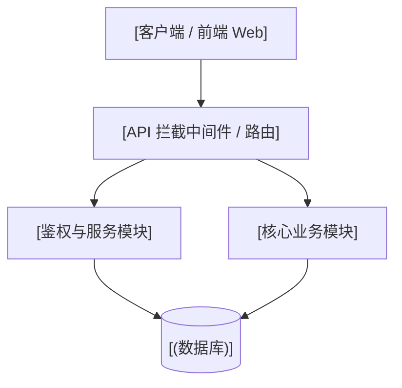

# 🏛️ 02 - 概要设计与系统架构图

> [!NOTE]
> ⚠️ **【参考示例模板说明】**：本文件为 Base 工程脚手架预置的架构设计范例与规范示例。实际项目开发时，请根据真实项目的架构拓扑与分层进行修改替换。

## 1. 系统总体架构拓扑图

## 2. 核心技术选型与分层原则
- **前端层**：HTML5 / CSS / Vanilla JS (轻量响应式设计)
- **业务控制层**：Node.js / Python / Java
- **数据持久层**：PostgreSQL / MySQL / SQLite
- **技术规约**：遵循 KISS 原则、看门狗护栏与单焦点开发规约。

## 3. 核心分层职责明细
- `src/controllers/`：处理 HTTP 请求与响应，参数校验。
- `src/services/`：封装纯业务逻辑与事务控制。
- `src/models/`：数据库 Schema 映射与持久化交互。
