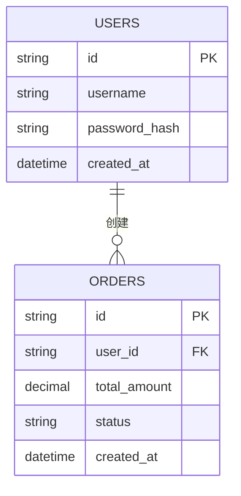

# 🗄️ 03 - 数据库设计与 ER 关系规约

> [!NOTE]
> ⚠️ **【参考示例模板说明】**：本文件为 Base 工程脚手架预置的数据库设计范例与 ER 规约示例。实际项目开发时，请根据真实项目的表结构与字段进行修改填充。

## 1. 数据表实体关系 (ER 图)

## 2. 数据字典 (Data Dictionary)

### 2.1 用户表 (`users`)
| 字段名 | 数据类型 | 约束 | 说明 |
| :--- | :--- | :--- | :--- |
| `id` | `VARCHAR(36)` | PRIMARY KEY | 主键 UUID |
| `username` | `VARCHAR(50)` | UNIQUE, NOT NULL | 登录账号 |
| `password_hash`| `VARCHAR(255)`| NOT NULL | 加盐散列密码 |
| `created_at` | `TIMESTAMP` | DEFAULT NOW() | 创建时间 |
