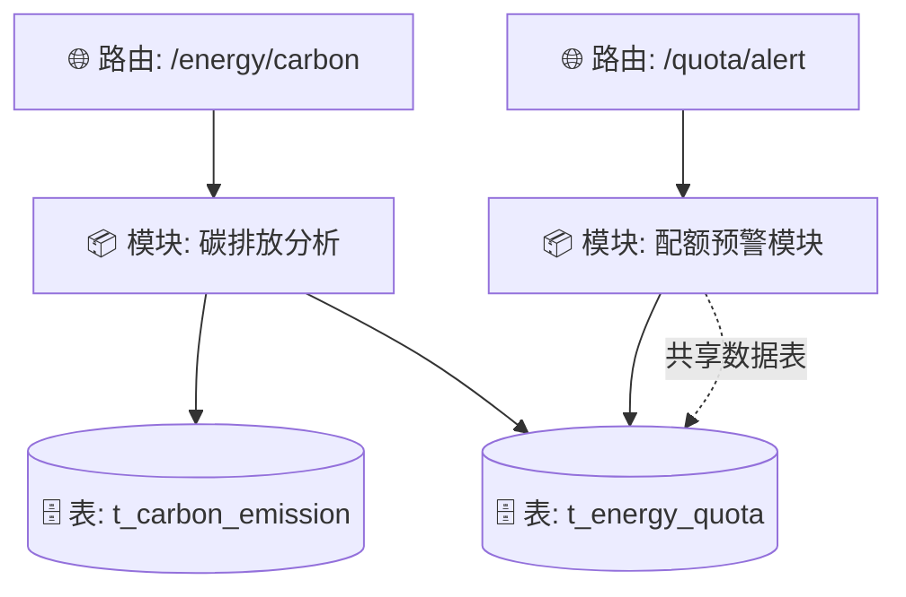

# 🕸️ 老项目路由元数据拆解与关系图谱分析指南 (Legacy Metadata Graph Analysis Guide)

> **本指南旨在提供一套工业级的老项目逆向解密与全盘拓扑梳理范式**。通过“路由入口切入 ➔ 四维元数据提取 ➔ 集中元数据池注册 ➔ 自动交集计算与关系图谱生成”，彻底杀死传统浅层扫描带来的“架构安全感假象 (BUG-008)”。

---

## 💡 1. 核心解题哲理 (Architectural Philosophy)

### ❌ 传统浅层扫描的漏洞 (为什么 tree 3 是假象？)
老项目目录深、耦合重、缺少文档。单纯扫描前 3 层目录只能看到 `src/main/java` 这类表皮，而真正的核心逻辑埋藏在第 5~9 层，跨模块的“隐藏耦合”（如模块 A 悄悄修改模块 B 的数据库表）完全处于视野盲区。

### 🟢 路由元数据图谱范式 (Obsidian Graph Pattern)
1. **以前端路由为突破口**：UI 界面与路由是黑盒老项目唯一的公开开口。
2. **提取四维硬核元数据**：每个模块提取 **路由 (Route)**、**文件 (Files)**、**API (接口)**、**数据表 (Tables)** 4 种确定性标识。
3. **元数据池碰撞 (Graph Slicing)**：将元数据注册入 `.ai/tier2_legacy_arch.md`。脚本自动对比交集，当检测到模块 A 与 模块 B 引用了相同的数据库表或 API 时，自动绘制跨模块关系连线！

---

## 🧩 2. 四维元数据提取模型 (4D Metadata Model)

每次分析一个功能模块，必须提取以下 4 种原子元数据（严禁使用白话模糊泛称，必须使用代码真实名称）：

| 节点维度 | 物理含义 | 示例 |
| :--- | :--- | :--- |
| **🌐 Route (路由入口)** | 前端页面 URL / 路由 Path | `/dashboard/energy/carbon-calc` |
| **📄 Files (关键源码文件)** | 负责该功能的跨层级核心文件列表 | `CarbonController.java`, `CarbonService.java`, `CarbonCalc.vue` |
| **🔌 API (绑定接口)** | 前后端通讯的 API 路径 | `POST /api/v1/carbon/calculate` |
| **🗄️ Tables (关联数据表)** | 读写的底层数据库表名 | `t_carbon_emission`, `t_energy_quota` |

---

## 🛠️ 3. 自动化分析脚本操作指引 (`arch.py`)

我们可以通过内置的脚本完成深层穿透与元数据图谱的自动注册：

### 1️⃣ 深度穿透搜索 (突破前 3 层限制)
当找不到某个业务文件在哪一层时，运行深度搜寻：
```bash
python .ai/scripts/arch.py find "carbon"
```
*输出：自动穿越 9 层目录，列出所有包含 `carbon` 的深层源码文件。*

### 2️⃣ 注册模块元数据并自动生成关系图谱
当你分析完一个路由对应的模块后，运行注册命令：
```bash
python .ai/scripts/arch.py analyze "/energy/carbon" "碳排放分析模块" "CarbonCalc.vue,CarbonService.java" "t_carbon_emission,t_energy_quota" "POST /api/v1/carbon/calc"
```

#### ⚙️ 脚本后台干了什么？
1. 将模块元数据卡片追加落盘至 `.ai/tier2_legacy_arch.md`（元数据池）；
2. 自动检测 `t_carbon_emission` 或 `t_energy_quota` 是否被此前分析过的其他模块使用过；
3. 若存在交集，自动在文件头部的 Mermaid 图谱中生成 **`[模块A] -. 共享数据表 .-> [t_carbon_emission]`** 跨域拓扑线条！

---

## 🕸️ 4. Mermaid 可视化关系图谱样例

经过多次路由分析注册后，`.ai/tier2_legacy_arch.md` 将自动生成并维持如下的可视化关系网：



> 💡 **解读**：图中高亮清晰地展现出【碳排放分析模块】与【配额预警模块】共同依赖并修改了 `t_energy_quota` 数据表。在对配额预警进行重构时，AI 与开发人员能瞬间识别出潜在影响范围！

---

## 🔄 5. 渐进式老项目梳理 SOP (5-Step Walkthrough)

针对任何庞大未知的老项目，按以下 SOP 步骤推进：

```plaintext
【第1步: 前端页面抓路由】➔ 【第2步: arch.py find 找出关键文件】➔ 【第3步: 分析提取 API 与数据表】
                                                                            │
【第5步: 查阅 Mermaid 图谱】◄─【第4步: 运行 arch.py analyze 注册元数据池】◄────┘
```

1. **第一步（捕获线索）**：打开浏览器，找到要梳理的功能页面，拿到 URL 路由（如 `/order/detail`）。
2. **第二步（深层搜寻）**：运行 `python .ai/scripts/arch.py find "order"`，快速定位第 5~8 层的核心控制器与服务文件。
3. **第三步（提取元数据）**：分析这几个文件，整理出关联的后端 API 及 `t_order` 等数据表。
4. **第四步（自动分析落盘）**：运行 `arch.py analyze` 命令，静默追加元数据并计算关联。
5. **第五步（查看关系网络）**：打开 `.ai/tier2_legacy_arch.md`，即刻查阅全工程模块之间的共享图谱网络。
