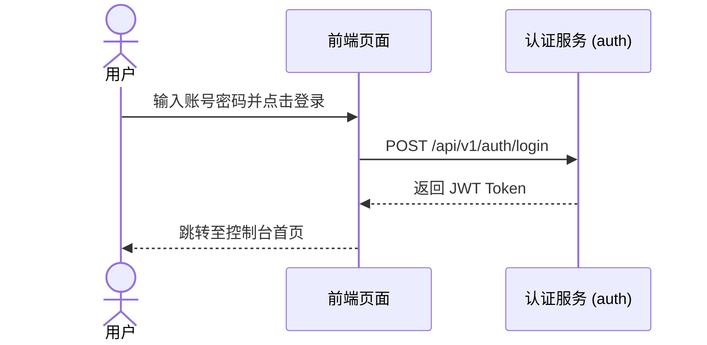

# 📄 [模块: 认证与权限] - 用户登录与权限控制 PRD

> [!NOTE]
> ⚠️ **【参考示例模板说明】**：本文件为 Base 工程脚手架预置的 PRD 格式范例与规范示例。实际项目开发时，请替换为真实项目的具体业务需求。

- **所属模块**：`auth` (认证与权限)
- **文档编号**：`PRD-AUTH-01`
- **关联需求**：`FR-01`
- **维护责任人**：产品经理 / PM

---

## 1. 业务场景与用户故事 (User Story)
作为系统用户，我希望通过输入用户名和密码登录系统，以便安全地访问我的个人控制台。

## 2. 详细功能点列表
- [ ] **FR-01-A 账号密码登录**：表单校验、加盐密码比对。
- [ ] **FR-01-B JWT Token 签发**：登录成功后返回有效期 2 小时的 Access Token。
- [ ] **FR-01-C 登出与 Token 失效**：点击登出清空本地 Session。

---

## 3. 业务流程与交互规范

