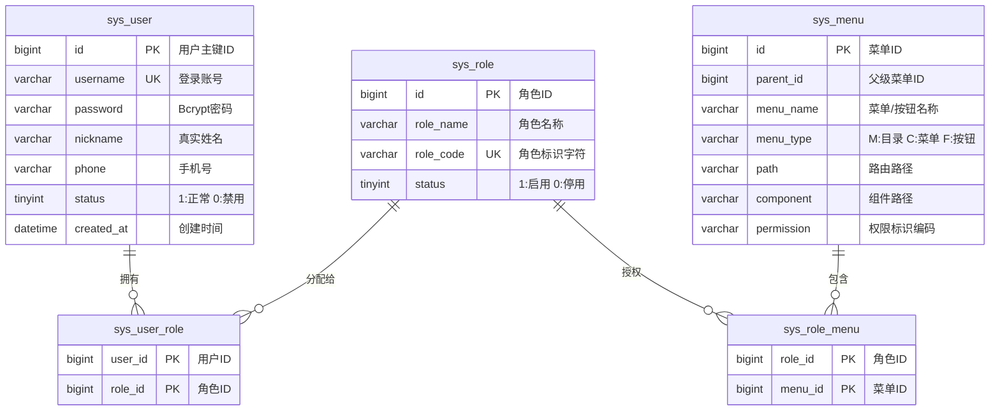

# 📐 DLD-SYS-PLATFORM-V1.0: 通用管理平台详细设计说明书

> 遵循【钧天科技 V1.0 8大章节标准】制作

---

## 1. 修订历史 (Revision History)

| 编号 | 章节名称 | 修订内容描述 | 修订日期 | 修订版本 | 修订人 |
| :--- | :--- | :--- | :--- | :--- | :--- |
| 1 | 全部 | 初始化通用后台管理平台 (SysPlatform) 详细设计说明书 | 2026-10-07 | V1.0 | AI 架构专家 |

---

## 2. 概述与总体约束 (Overview & Constraints)

### 2.1 设计目标
构建一套轻量化、高扩展、RBAC1 确定性授权的后台管理底座。支持管理员统一开户、多级动态路由菜单映射及按钮级 Action 拦截。

### 2.2 架构分层详情表 (Architectural Layering)

| 架构层级 | 技术选型 | 关键职责描述 |
| :--- | :--- | :--- |
| **前端 View 层** | Vue 3 / Vite / TypeScript | 结合 `mockup.html` 样式风格，负责动态路由挂载、Store 响应式菜单及按钮权限指令 (`v-permission`) |
| **网关/认证拦截层** | Spring Security / Sa-Token / JWT | 负责 HTTP Header 中 `Authorization: Bearer <token>` 拦截、Token 有效期校验与上下文装载 |
| **业务 Service 层** | Spring Boot / Java 17 | 实施账号状态防线、密码 Bcrypt 加盐比对、角色-菜单关联关系校验 |
| **持久 DAO 层** | MyBatis-Plus / MySQL 8.0 | 执行数据 CRUD、批量物理/逻辑删除及二级级联外键索引映射 |

### 2.3 性能与安全约束
- **接口响应 SLA**：所有基础 RBAC 查询及 Token 签发接口 99% 响应耗时低于 `100ms`。
- **密码存储约束**：严禁明文或不可逆哈希存储，强制使用 `Bcrypt` 加盐哈希算法（强度因子 `10`）。
- **权限防超越**：每次敏感操作 API 请求，后端拦截器必须二次比对当前用户关联的 `permission_code` 编码。

---

## 3. 核心模块详细设计 (Core Module Design)

### 3.1 核心包结构树 (Package Structure)
```plaintext
backend/src/main/java/com/apex/sys/
├── controller/
│   ├── AuthController.java          # 登录认证与 Token 刷新
│   ├── SysUserController.java       # 用户管理与管理员开户
│   ├── SysRoleController.java       # 角色组与权限授权
│   ├── SysMenuController.java       # 动态菜单树与按钮编码
│   └── SysNotifyController.java     # 消息公告与站内信
├── service/
│   ├── AuthService.java
│   ├── SysUserService.java
│   ├── SysRoleService.java
│   └── SysMenuService.java
├── domain/
│   ├── dto/                         # 接口入参 DTO (含 @NotNull @NotBlank 校验)
│   ├── vo/                          # 响应体 VO (脱敏数据)
│   └── entity/                      # 数据库映射实体
└── mapper/                          # MyBatis 映射接口
```

---

## 4. 接口详细设计 (API Detailed Contract)

### 4.1 🔐 [API-SYS-01] 账号密码登录与 Token 签发
- **URL**: `/api/v1/sys/auth/login`
- **Method**: `POST`
- **Request Headers**: `Content-Type: application/json`
- **Request Body**:
  ```json
  {
    "username": "admin",
    "password": "RawPassword123!"
  }
  ```
- **Response 200 OK**:
  ```json
  {
    "code": 200,
    "msg": "登录成功",
    "data": {
      "token": "eyJhbGciOiJIUzI1NiIsInR5cCI6IkpXVCJ9...",
      "tokenType": "Bearer",
      "expiresIn": 7200,
      "user": {
        "userId": 1001,
        "username": "admin",
        "nickname": "超级管理员",
        "roles": ["admin"]
      }
    }
  }
  ```
- **错误响应码**:
  - `4001`: 账号或密码错误
  - `4002`: 账号已被管理员禁用

---

### 4.2 👤 [API-SYS-02] 管理员开户创建新用户
- **URL**: `/api/v1/sys/users`
- **Method**: `POST`
- **Request Headers**: 
  - `Content-Type: application/json`
  - `Authorization: Bearer <Token>`
- **Request Body**:
  ```json
  {
    "username": "zhangsan",
    "nickname": "张三",
    "phone": "13911223344",
    "password": "InitialPassword123",
    "roleIds": [2]
  }
  ```
- **Response 200 OK**:
  ```json
  {
    "code": 200,
    "msg": "用户账号开户成功",
    "data": {
      "userId": 1002,
      "username": "zhangsan",
      "status": 1
    }
  }
  ```
- **错误响应码**:
  - `4003`: 用户名已被占用

---

### 4.3 ⚙️ [API-SYS-03] 获取当前登录用户的动态菜单树
- **URL**: `/api/v1/sys/menus/routers`
- **Method**: `GET`
- **Response 200 OK**:
  ```json
  {
    "code": 200,
    "msg": "success",
    "data": [
      {
        "menuId": 1,
        "title": "系统管理",
        "path": "/system",
        "component": "Layout",
        "icon": "Setting",
        "children": [
          {
            "menuId": 2,
            "title": "用户管理",
            "path": "/system/user",
            "component": "system/user/index",
            "permission": "sys:user:list"
          }
        ]
      }
    ]
  }
  ```

---

## 5. 数据库详细设计 (Database Detailed Schema)

### 5.1 关系 ER 图 (Entity Relationship Diagram)



### 5.2 数据表结构明细表 (Tables Schema)

#### 表 1：`sys_user` (系统用户表)

| 字段名 | 数据类型 | 长度 | 主键 | 必填 | 默认值 | 备注说明 |
| :--- | :--- | :--- | :--- | :--- | :--- | :--- |
| `id` | `BIGINT` | 20 | 是 | 是 | AUTO_INCREMENT | 唯一主键 ID |
| `username` | `VARCHAR` | 50 | 否 | 是 | - | 登录账号 (唯一索引 `uk_username`) |
| `password` | `VARCHAR` | 100 | 否 | 是 | - | Bcrypt 加密密码 |
| `nickname` | `VARCHAR` | 50 | 否 | 是 | '' | 真实姓名/昵称 |
| `phone` | `VARCHAR` | 20 | 否 | 否 | '' | 手机号码 |
| `status` | `TINYINT` | 4 | 否 | 是 | `1` | 账号状态 (1:正常, 0:禁用) |
| `created_at` | `DATETIME` | - | 否 | 是 | `CURRENT_TIMESTAMP` | 创建时间 |
| `updated_at` | `DATETIME` | - | 否 | 是 | `CURRENT_TIMESTAMP` | 更新时间 |

---

#### 表 2：`sys_role` (系统角色表)

| 字段名 | 数据类型 | 长度 | 主键 | 必填 | 默认值 | 备注说明 |
| :--- | :--- | :--- | :--- | :--- | :--- | :--- |
| `id` | `BIGINT` | 20 | 是 | 是 | AUTO_INCREMENT | 角色主键 ID |
| `role_name` | `VARCHAR` | 50 | 否 | 是 | - | 角色名称 (如: 研发工程师) |
| `role_code` | `VARCHAR` | 50 | 否 | 是 | - | 角色编码 (唯一索引 `uk_role_code`) |
| `sort` | `INT` | 11 | 否 | 是 | `0` | 显示排序 |
| `status` | `TINYINT` | 4 | 否 | 是 | `1` | 状态 (1:启用, 0:停用) |

---

#### 表 3：`sys_menu` (系统菜单权限表)

| 字段名 | 数据类型 | 长度 | 主键 | 必填 | 默认值 | 备注说明 |
| :--- | :--- | :--- | :--- | :--- | :--- | :--- |
| `id` | `BIGINT` | 20 | 是 | 是 | AUTO_INCREMENT | 菜单主键 ID |
| `parent_id` | `BIGINT` | 20 | 否 | 是 | `0` | 父菜单 ID (0代表顶级) |
| `menu_name` | `VARCHAR` | 50 | 否 | 是 | - | 菜单/按钮名称 |
| `menu_type` | `CHAR` | 1 | 否 | 是 | 'C' | 类型 (`M`:目录, `C`:菜单, `F`:按钮) |
| `path` | `VARCHAR` | 200 | 否 | 否 | '' | 前端路由地址 |
| `component` | `VARCHAR` | 255 | 否 | 否 | '' | 前端组件路径 |
| `permission` | `VARCHAR` | 100 | 否 | 否 | '' | 权限标识 (如 `sys:user:add`) |
| `sort` | `INT` | 11 | 否 | 是 | `0` | 排序值 |

---

## 6. 非功能详细设计 (Non-Functional & Security)

### 6.1 Token 安全防篡改机制
- 采用 `RS256` 非对称加密或 `HS256` HMAC 秘钥签发 JWT。
- 密钥由环境变量 `${JWT_SECRET}` 动态注入，严禁明文硬编码于代码中（触发 Security Guard）。

---

## 7. 风险应对矩阵 (Risk Mitigation)

| 风险点 | 风险级别 | 应对设计方案 |
| :--- | :--- | :--- |
| 超级管理员 `admin` 账号被误禁或误删 | 高 | 数据库拦截器硬编码拦截：`id=1` 或 `role_code='admin'` 禁止被修改状态与物理删除 |
| 弱密码穷举攻击 | 中 | 登录失败累计 5 次自动锁定账号 15 分钟 |

---

## 8. 附录与 SQL 初始化脚本位置
- DDL 脚本自动同步至：[base_template/docs/db/service.sql](file:///Users/up_dong/Documents/java_workspace/Apex/base_template/docs/db/service.sql)
