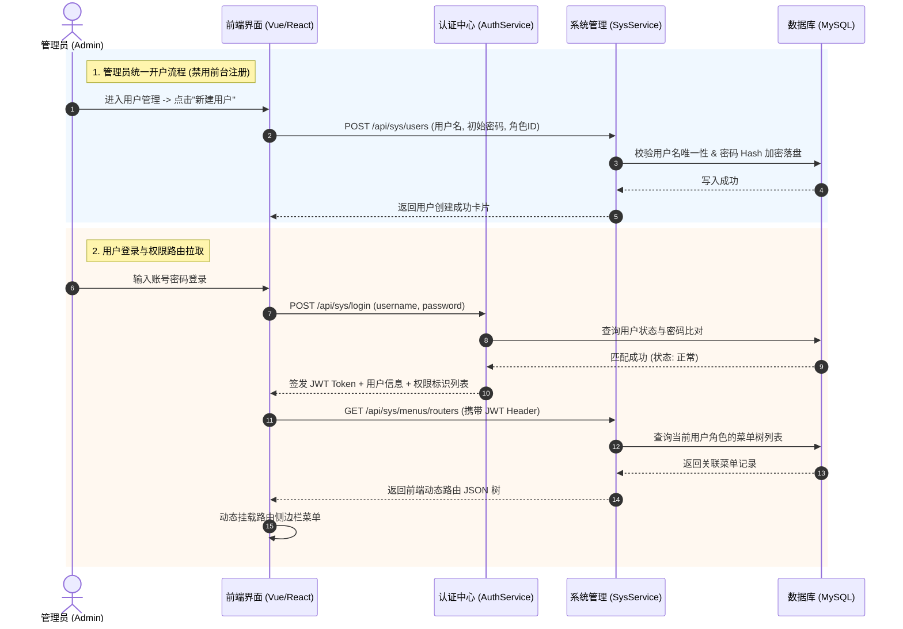

# 📄 PRD-SYS-PLATFORM-V1.0: 通用后台管理平台核心模块需求规格说明书

---

## 🎯 1. 模块定位与核心规则

本模块旨在为系统提供类似于“若依 (RuoYi)”架构的通用后台管理平台核心骨架，涵盖用户认证、用户管理、RBAC 角色权限控制、动态菜单管理及消息通知体系。

### 核心决议与避坑约束
- **开户模式锁死**：采用 **管理员统一开户模式（选项 C）**。隐藏/禁止前台开放自由注册，所有账号统一由超级管理员 (`admin`) 在“用户管理”菜单创建并分配角色与初始密码。
- **阶段规划（渐进式）**：多租户数据隔离（SAAS 化）及高级图形/短信验证码防刷机制移至后续 V2.0 演进版本，V1.0 专注于经典单租户 RBAC 权限与基础认证的确定性交付。

---

## 🧩 2. 功能清单与逻辑说明

### 2.1 🔐 身份认证与 Token 签发 (`sys_auth`)
- **后台账号登录**：支持用户名/手机号 + 密码提交登录。
- **登录状态校验**：认证成功签发安全 JWT Token，返回当前用户基本信息、所属角色列表及分配的菜单/按钮权限集合（`permissions`）。
- **登出与过期**：支持注销登录（前端清除 Token 本地存储），Token 默认有效期 2 小时，自动拦截未授权的 API 请求（HTTP 401）。

### 2.2 👤 用户管理与账号控制 (`sys_user`)
- **用户列表查询**：支持按用户名、手机号、账号状态（正常/禁用）分页筛选。
- **新增用户账号**（仅管理员）：填写用户名、真实姓名、手机号、初始密码、所属角色等。
- **用户状态控制**：提供“启用/禁用”一键开关，禁用的账号立即拒绝登录并阻断接口访问。
- **重置密码**：管理员可为指定用户一键重置初始密码。

### 2.3 🛡️ RBAC 角色与权限分配 (`sys_role`)
- **角色列表与管理**：角色名称、角色字符标识（如 `admin`, `common`, `auditor`）、排序值及备注。
- **菜单权限树分配**：在角色编辑弹窗中，通过树状复选框展示系统所有菜单与按钮，支持勾选授权。
- **数据权限隔离预留**：架构预留数据范围标识（仅本人数据、本部门数据、全系统数据）。

### 2.4 ⚙️ 动态菜单管理 (`sys_menu`)
- **菜单树结构管理**：支持目录（Directory）、菜单（Menu）、按钮（Button）三级树状定义。
- **菜单属性**：菜单名称、图标 (Icon)、路由地址 (Path)、前端组件路径 (Component)、排序值 (Sort)、是否外链、是否隐藏。
- **按钮级权限标识**：定义按钮操作编码（如 `sys:user:add`, `sys:user:delete`, `sys:role:edit`）。

### 2.5 🔔 站内消息通知 (`sys_notify`)
- **消息通知发布**：管理员可发布系统公告/站内通知（支持全员通知或指定角色/用户接收）。
- **已读/未读状态**：用户顶部导航栏显示红点未读消息数，点击列表标记为已读。

---

## 📊 3. 核心业务交互时序图 (Mermaid Sequence Diagram)

---

## 🎨 4. 界面线框原型结构

前端原型交互详见配套的 HTML 原型文件：
- 🖥️ **交互原型**：[mockup.html](file:///Users/up_dong/Documents/java_workspace/Apex/base_template/docs/modules/sys_platform/mockup.html)
