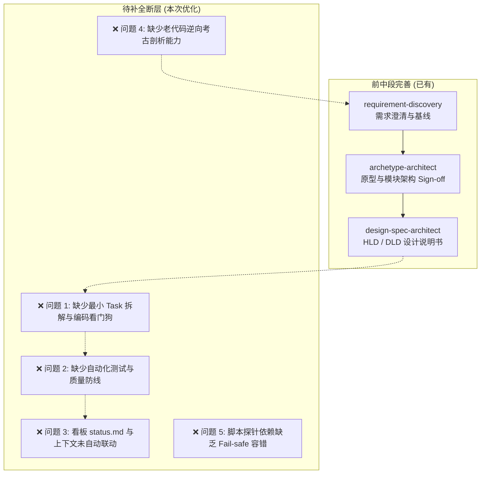

# 📋 Apex 工作流问题诊断与优化待办清单 (Workflow Issue & Action Plan)

> **创建时间**：2026-10-06  
> **文档说明**：本文件总结了当前 Apex 工作流体系（包含需求发现 `requirement-discovery`、原型架构 `archetype-architect`、设计说明书 `design-spec-architect` 及 Vibe Coding 3.0 Standard）存在的核心断层、痛点与后续改进落地计划。

---

## 🏛️ 一、 现状评估与能力全景

当前工作流在**前中段（需求发现 ➔ 原型交互 ➔ 架构设计说明书）**拥有极高的工程化水准：
- **需求发现 (`requirement-discovery`)**：AI 主导澄清、白话术语转换、动态决策树收敛需求基线。
- **原型架构 (`archetype-architect`)**：静态 DOM 确定性扫描、Grill 盲区质询、高对比度 Mermaid 架构图与 Sign-off 门禁。
- **设计说明书 (`design-spec-architect`)**：对齐钧天科技 V1.0 企业级标准，输出 HLD/DLD 并支持需求变更时的增量 Diff。

---

## 🔍 二、 5 大核心问题与断层分析



### 1. ❌ 问题 1：DLD 契约到真实代码落地的“规范与绑定断层” (DLD-to-Code Binding Gap)
- **现象**：虽然有 `.ai/sop/02-sop-coding.md` 作为通用开发流程 SOP，但在具体进行 Java/Vue 代码编写时，缺少特定技术栈的**代码编写规范**与**DLD 契约强绑定规则**。
- **痛点**：AI 在执行通用 `02-sop-coding` 时，容易忽略 `docs/.../dld-v1.0.md` 中定义的精准字段名、索引及 API 响应格式，导致代码与设计说明书脱节，或写出不符合团队语言规范的代码。
- **优化方案**：保持 `02-sop-coding.md` 作为轻量通用开发 SOP 流程，新增**按需加载的技术栈开发规约 Skill**（如 `coding-convention-java`、`coding-convention-vue`），在编码时自动绑定 DLD 契约并强制代码规范。

### 2. ❌ 问题 2：缺乏自动化测试与质量闭环 (Verification Gap)
- **现象**：工作流止步于设计说明书与原型 Sign-off，代码完成后缺乏自动化质量校验。
- **痛点**：完全依赖人类手动点按界面测试，效率低且容易遗漏隐蔽 Bug。缺少 TDD 测试驱动、接口 API 连通性探针及小黄鸭报错定位能力。

### 3. ❌ 问题 3：状态看板与上下文治理未自动化联动 (Governance Gap)
- **现象**：Skill 的产出物仅保存在 `docs/` 目录下，未自动与 `.ai/status.md` 看板状态机（`board.py`）联动，也未自动提示用户做 Context Pruning（上下文归档）。
- **痛点**：在完成需求或设计后如果不及时归档，长对话历史会导致上下文膨胀、Token 浪费严重及大模型产生幻觉。

### 4. ❌ 问题 4：老项目/遗留代码（Legacy Code）逆向考古能力缺失
- **现象**：现有流程偏向于“从 0 到 1 新建项目”（设计 ➔ 原型 ➔ HLD/DLD）。
- **痛点**：面对已有几万行代码的老项目时，自顶向下的流程过于笨重，无法快速自底向上提取 Controller/Service 业务切片并锁定既有行为。

### 5. ❌ 问题 5：工具链探针缺乏 Fail-safe 容错降级机制
- **现象**：如 `archetype-architect` 依赖 `parse_html.py` 等 Python 脚本。
- **痛点**：若用户环境缺失第三方库（如 BeautifulSoup）或脚本执行报错，流程会中断，缺乏自动降级为静态正则解析或纯 LLM 提取的容错机制。

### 6. ❌ 问题 6：本地基础设施与运行环境预检机制缺失 (Pre-flight Infrastructure & Migration Gap)
- **现象**：`quality-verifier` 试图运行 API 或数据库连通性测试，但缺乏数据库启动状态、Schema 数据初始化 (Migration SQL) 或第三方依赖服务的健康度校验。
- **痛点**：测试脚本直接崩溃且无法识别是环境未就绪还是代码 Bug，导致 TDD 验证失效；修改表结构时缺乏渐进式 Migration 脚本管理（如 Flyway/Liquibase 规范）。

### 7. ❌ 问题 7：快修/紧急变更导致的“文档-代码反向漂移” (Fast-track Doc-Code Drift)
- **现象**：`03_fast-sop-fasttrack` 极速通道允许跳过 `status.md` 状态机与 DLD 审批直修代码。
- **痛点**：频繁快修后，实际代码的字段/接口参数发生变化，但 DLD 设计说明书未同步更新，导致架构文档再次沦为“过时产物”。

### 8. ❌ 问题 8：公共底层改动缺乏“影响范围自判与全量回归机制” (Impact Analysis Protocol)
- **现象**：修改底层通用模块（如 Auth 拦截器、BaseEntity、公共 Util 或全局配置）时，AI 仅对当前任务包含的文件进行修改。
- **痛点**：引发上游其他模块静默破坏（Silent Disruption），且缺乏“受影响模块扫描与全量回归测试”警报机制。

### 9. ❌ 问题 9：SOP 与 Skill 规则膨胀导致的优先级冲突与 Token 效率损失 (Rule Congestion & Routing Overlap)
- **现象**：系统内同时存在 `00`~`06` 8 个 SOP、6 大 Skill 以及 `.windsurfrules` / `.cursorrules`，部分指令与路由触发词存在交叉。
- **痛点**：静态 Prompt 过于臃肿，大量重复上下文占据 Token 窗口，且存在微小的规则竞争与边界模糊（如通用 debug SOP 与 quality-verifier 小黄鸭排错）。

### 10. ❌ 问题 10：硬编码凭据与敏感数据防线缺失 (Secret & Security Hardening Gap)
- **现象**：在写配置文件、测试代码或 API 调试脚本时，AI 或开发者可能直接硬编码数据库密码、第三方 API Key 或 Token。
- **痛点**：存在敏感秘钥泄露至 Git 仓库的严重安全隐患，缺乏预提交脱敏扫描（Pre-commit Secret Guard）。

### 11. ❌ 问题 11：长会话上下文衰减与 Agent 协作手递手规范缺失 (Context Degradation & Handover Checklist)
- **现象**：在同一窗口进行长对话（30+ 轮）后，大模型注意力机制衰减，极易产生“记住旧规范、忘记 DLD 新契约”的幻觉。
- **痛点**：缺乏 Token 阈值主动告警机制，缺少清晰的 Agent/Subagent 任务交接卡（Handover Protocol），依赖用户人工发 [5] 归档。

### 12. ❌ 问题 12：模拟数据/Mock 服务与 Seed Data 自动化生成缺失 (Mock & Test Data Generation Gap)
- **现象**：在前后端并行开发（Front-Back Separation）或基础设施未就绪时，前端与契约验证缺乏开箱即用的 Mock 接口与数据库 Seed 填充脚本。
- **痛点**：依赖手动构造假数据或等待后端真实 API 上线，导致前后端联调阻塞，且手写 Mock 数据覆盖度低，难以触发边界条件与异常分支。

### 13. ❌ 问题 13：多 Agent 并行协作策略与 Git 分支隔离机制缺失 (Multi-Agent Concurrent Branch Protocol)
- **现象**：当同时启动多个 Agent 或并行处理不同子任务（如一个 Agent 写 Vue 前端，一个写 Spring Boot 后端，另一个更新设计文档）时，缺少明确的分支隔离与文件锁定机制。
- **痛点**：多 Agent 并行写代码或更新 `.ai/status.md` 看板时，极易造成 Git 代码覆盖冲突、看板状态锁死或上下文相互污染。

### 14. ❌ 问题 14：性能压测、慢 SQL 与 SLA 响应时间回归防线缺失 (Performance & SLA Regression Guard)
- **现象**：`quality-verifier` 目前仅验证功能的正确性与 API 契约格式（如 200 OK），缺少对响应延时 (RT)、SQL 慢查询与 ORM N+1 问题的检测。
- **痛点**：隐蔽的性能陷阱（如全表扫描、循环查库、大对象内存泄漏）顺畅通过功能测试，部署后导致系统崩溃或响应迟钝。

### 15. ❌ 问题 15：微服务/分布式契约与跨仓库依赖拓扑分析缺失 (Distributed Contract & Cross-Repository Topology)
- **现象**：现有影响范围分析（Task-11）集中于单体项目内部代码依赖。
- **痛点**：面对 RPC 接口 (Dubbo/Feign)、消息队列 (Kafka/RocketMQ) 消息体或分布式事件变更时，无法识别上下游跨服务依赖，导致下游服务运行时反序列化报错或消息丢失。

### 16. ❌ 问题 16：可观测性打点与可排查性日志规范缺失 (Observability & Structured Logging Standard)
- **现象**：代码生成时仅聚焦业务逻辑，缺乏 TraceID 链路传递、结构化日志 (MDC) 打印与业务关键 Metrics 打点。
- **痛点**：生产环境故障发生时，日志缺乏 requestId/userId/orderNo 等关键业务上下文，导致线上事故定位耗时极长。

### 17. ❌ 问题 17：踩坑经验教训自我演进与知识库反哺闭环缺失 (Self-Evolution & Knowledge Base Feedback Loop)
- **现象**：排查解决复杂的 Bug 或框架踩坑（如 Maven 依赖冲突、特定数据库驱动陷阱）后，修复经验止步于单次 Session 结束。
- **痛点**：无法将解决方案自动提纯为 Project Knowledge Item (KI) 或 Skill 规则，导致 Agent 在未来的对话中重复犯同样的错误。

---

## 🎯 三、 改进待办清单 (Actionable Todo List)

### 📌 阶段一：补全实施与质量 Skill 库

- [x] **Task-01: 新建【统一代码规范与 DLD 契约绑定】Skill (`.agents/skills/coding-standards/`)**
  - [x] **创建主入口 `SKILL.md`**：定义统一的 DLD 契约绑定铁律、按需加载路由（根据项目/任务自动加载对应 reference）、分层开发原则。
  - [x] **编写语言规约参考库 (`references/`)**：
    - [x] `references/java-convention.md`：Java (Spring Boot / MyBatis-Plus / DTO / VO / Entity / 统一响应 `R<T>`) 规范。
    - [x] `references/vue-convention.md`：Vue 3 (TypeScript / Pinia / Element Plus / Axios API 契约) 规范。
    - [x] `references/dld-binding-checklist.md`：DLD 表结构与 API 契约强绑定核对清单。
  - [x] **与 `.ai/sop/02-sop-coding.md` 联动**：在通用 SOP 提示中增加关联，指引 AI 编码时自动激活该 Skill。

- [x] **Task-02: 新增【质量验证与测试用例先行小黄鸭排错】Skill (`.agents/skills/quality-verifier`)**
  - [x] **编写 `SKILL.md` 与 TDD 机制**：基于 DLD 契约在编码前自动生成测试用例文档 (`docs/test-cases/`) 及自动化 cURL / 测试脚本。
  - [x] **集成契约自动化验证**：代码编写完成后，运行自动化脚本碰撞 DLD 契约，验证接口连通性与格式。
  - [x] **集成小黄鸭探针调试法**：发生报错时自动抓取完整日志，按“出现异常 ➔ 原因分析 ➔ 方案验证”循环修复。

- [x] **Task-03: 新增【老项目逆向考古】Skill (`.agents/skills/legacy-archaeologist`)**
  - [x] **编写 `SKILL.md` 与切片规约**：支持自顶向下扫描路由与 Controller/Service 切片及链路定位。
  - [x] **契约提纯与行为锁死探针**：自动逆向提取老接口契约并生成 `docs/legacy/legacy_hld_<module>.md`，编写反向验证探针 (`test_legacy_*.py`) 锁死老代码行为。

---

### 📌 阶段二：自动化看板与上下文治理联动

- [x] **Task-04: 改造 `requirement-discovery` 增加状态机同步**
  - [x] 在需求基线收敛后（Phase 5），自动调用 `board.py add` 将新需求转化为待办 Task，并输出上下文清理提示。

- [x] **Task-05: 改造 `archetype-architect` 增加 Sign-off 自动联动**
  - [x] 原型 Sign-off 确认后，自动在 `.ai/status.md` 注册原型关联任务，并自动更新 `.ai/tier2_modules.md`。

- [x] **Task-06: 改造 `design-spec-architect` 增量同步看板**
  - [x] HLD/DLD 生成或 Diff 变更后，自动更新 `.ai/status.md` 中任务的关联设计文档路径。

---

### 📌 阶段三：工具链鲁棒性与体验强化

- [x] **Task-07: 为探针脚本增加降级容错 (Fail-safe)**
  - [x] 给 `parse_html.py` 和 `validate_mermaid.py` 增加异常捕获与字符串过滤，在语法非标或嵌套冲突时，自动退化为纯文本正则解析或输出降级提示。

- [x] **Task-08: 更新顶层 `README.md` 与 `.cursorrules` 路由表**
  - [x] 将补充与创建的 Skill（`coding-standards`, `quality-verifier`, `legacy-archaeologist`, `requirement-discovery`, `archetype-architect`, `design-spec-architect`）全量注册到顶层数字路由说明与脚手架结构中。

---

### 📌 阶段四：高级工程化防线与演进机制 (Deep-Water Architecture)

- [x] **Task-09: 引入环境预检与 DB Migration 渐进式变更规范 (Pre-flight & Migration Protocol)**
  - [x] 新建参考规约 `references/preflight-and-migration-guide.md`，定义环境探针预检（DB/Port/Docker连通性）与 Flyway/Liquibase 标准的 `V...sql` (演进) / `U...sql` (回滚) 渐进式 SQL 变更规范。
  - [x] 升级 `quality-verifier`，在发起契约测试前增加环境探针预检，避免由于基础设施未就绪误判为代码逻辑错误。

- [x] **Task-10: 新增“快修反向反哺 DLD”的漂移检查钩子 (Doc-Code Sync Guard)**
  - [x] 改造 `03_fast-sop-fasttrack.md`，在快轨道护栏与执行流中注入 Schema 比对机制，遇到 API/DTO/Entity 变动时自动增量反哺 DLD 详细设计说明书。

- [x] **Task-11: 建立通用公共代码修改的“影响范围自判协议” (Impact Analysis Checklist)**
  - [x] 新建参考规约 `references/impact-analysis-checklist.md`，制定三步走影响扫描协议（改动识别➔grep_search依赖扫描➔影响报告与回归Checklist）。
  - [x] 改造 `coding-standards` 与 `02-sop-coding.md` 看门狗护栏，强制要求修改 Base/Util/公共类时先扫依赖并输出影响报告。

- [x] **Task-12: SOP 与 Skill 规则按需动态加载优化 (Tiered Lazy Loading)**
  - [x] 精简 `.windsurfrules` 与 `.cursorrules` 中的静态全量展开文本，重构成轻量索引表，实现按场景动态 `view_file` 加载 `SKILL.md`，节省 70%+ 静态 Token 占用。

- [x] **Task-13: 引入预提交秘钥脱敏与安全扫描规范 (Secret Guard Checklist)**
  - [x] 新建参考规约 `references/secret-guard-checklist.md`，定义 6 类敏感秘钥（密码/API Key/AK-SK/私钥）匹配正则与占位符注入规范。
  - [x] 升级 `quality-verifier` Phase 2，注入静态代码秘钥脱敏扫描 (Secret Guard Scan)，禁止明文凭据硬编码进入工程。

- [x] **Task-14: 长会话 Token 衰减主动告警与 Agent 交接卡规范 (Handover Protocol)**
  - [x] 新建参考规约 `references/agent-handover-protocol.md`，制定上下文 15+ 轮 Token 衰减主动告警规则，以及标准交接文档 (`docs/handovers/handover-*.md`) 规范。
  - [x] 改造 `05-sop-archive.md` 与 `06-sop-resume.md`，支持无损断点归档与 Handover Artifact 标准导出。

---

### 📌 阶段五：高阶架构、全生命周期与自我演进闭环 (Enterprise Lifecycle & Self-Evolution)

- [x] **Task-15: 新增【契约驱动 Mock & 种子数据自动化】规范 (Mock & Seed Data Generator)**
  - [x] 基于 DLD API 契约自动生成 Mock Server 描述（或 Mockjs/WireMock 规则），支持前端零等待并行联调。
  - [x] 编写表结构 Seed Data 自动生成脚本逻辑，为 `quality-verifier` 提供包含边界条件的真实测试数据集。
  - [x] 引入防泄露标记 Header/Body 规则与部署前静态/运行时熔断拦截看门狗 (`references/mock-and-seed-guide.md`)。

- [ ] **Task-16: 制定【多 Agent 并行 Git 分支与锁机制】(Multi-Agent Concurrency Protocol)** `🧩 [P2 - 演进扩展]`
  - [ ] 建立 `feature/task-id` 分支隔离规范，定义 Subagent 独立工作空间与交接合并流。
  - [ ] 改造 `.ai/status.md` 加入 Task File Lock（任务文件锁），防止并发 Agent 互相覆盖看板或共享变量。

- [x] **Task-17: 引入【性能基准与慢查询看门狗】(Performance & Slow Query Guard)**
  - [x] 升级 `quality-verifier`，增加 API 响应延迟门限检查 (SLA Assertion, e.g., RT < 200ms)。
  - [x] 增加 SQL 性能防线探针，静态检测 SQL 全表扫描、ORM 循环查库 (N+1) 与索引失效 (`references/performance-and-slow-query-guide.md`)。

- [ ] **Task-18: 补全【微服务与跨服务依赖拓扑扫描】(Cross-Service Contract Protocol)** `🧩 [P2 - 演进扩展]`
  - [ ] 扩展影响分析 Checklist (`references/impact-analysis-checklist.md`)，引入 DTO/Event/RPC 接口跨服务映射矩阵。
  - [ ] 在修改公共 DTO/Event 消息体时，强制提示扫描并同步更新 RPC 消费端与 MQ Consumer 契约。

- [x] **Task-19: 制定【可观测性打点与日志诊断规范】(Observability Standard)**
  - [x] 在 `coding-standards` 中引入日志规约：强制 Controller/Service 层注入 MDC TraceID、关键业务入参/出参结构化日志 (`references/observability-and-logging-guide.md`)。
  - [x] 提供标准 Log 格式模板、脱敏守则与 Exception Handler 统一打点防线，强支撑小黄鸭探针排错。

- [x] **Task-20: 建立【排错经验反哺与 Knowledge 自动演进闭环】(Self-Evolution & KI Loop)**
  - [x] 改造 `quality-verifier` 小黄鸭排错成功后的收尾动作：遇到高价值/非偶然 Bug 时，自动生成复盘卡片 `postmortem-*.md` (`references/self-evolution-and-ki-guide.md`)。
  - [x] 改造 `.ai/sop/05-sop-archive.md`，在归档时自动扫描排错记录并反哺提炼为可持续复用的工程规则。

---

### 18. ❌ 问题 18：Vue 3 + Java (Spring Boot) 专项技术栈模板与脚手架规范落地深度不足 (Vue & Spring Boot Specialization Gap)
- **现象**：现有规范偏向通用契约约束，缺乏针对 Vue 3 (Composition API `<script setup>` + Pinia + Vite + Element Plus) 与 Java (Spring Boot 3 + MyBatis-Plus + `Result<T>` + 全局异常处理) 的工程级模版与代码基线沉淀。
- **痛点**：AI 生成代码时，不同 Session 或模块间容易产生代码风格割裂，且每次新项目都需要重构基础响应类、拦截器和配置，降低开发一致性与效率。

### 19. ❌ 问题 19：DevOps、Nginx 反向代理与 Docker-Compose 容器化部署闭环缺失 (DevOps & Containerized Deployment Gap)
- **现象**：工作流目前止步于代码编写与测试验证，缺乏应用打包构建、Nginx 反向代理配置、跨域 (CORS) 路由以及 Docker/Docker-Compose 部署链条。
- **痛点**：前后端分离开发中本地联调易卡在跨域与 Nginx 代理上，且交付阶段缺乏标准一键式容器化部署能力。

### 20. ❌ 问题 20：DLD API 契约与前端 TypeScript 请求/类型一键导出的协同链路缺失 (OpenAPI-to-TypeScript Contract Automation Gap)
- **现象**：`design-spec-architect` 输出了 API 设计说明书，但前端编写 Vue 代码时仍需要手写 API 路径、请求参数和 TS 类型接口。
- **痛点**：手动编写与同步 API 接口易因拼写或类型不一致导致运行时错误，未能实现“设计即类型”的自动打通。

### 21. ❌ 问题 21：设计说明书 (DLD) 生成与测试说明书 (Testcase) 的连贯自动化触发缺失 (DLD-to-Testcase Chain Automation Gap)
- **现象**：在 `design-spec-architect` 生成 HLD/DLD 详细设计说明书后，流程直接跳转至“已完成，回复 [2] 开始写代码”，未自动连贯触发 `quality-verifier` 专家技能落盘配套的《测试说明书》与自动化脚本。
- **痛点**：导致测试用例与测试脚本的生成节点显得滞后或断层，用户需要手动询问“测试说明书什么时候写”。
- **优化方案**：在 `design-spec-architect` 的 Phase 4 中强制追加硬性链式触发规则（`Test-First Linkage`），规定每当生成或更新 DLD 说明书时，必须在同一步骤中自动调用 `quality-verifier` 生成 `docs/test-cases/<module_name>-testcase.md` 测试说明书及 `scripts/tests/test_<module_name>.py` 自动化测试脚本，实现架构设计与测试契约的 100% 连贯自动产出。

---

### 📌 阶段六：Vue + Java 专项技术栈深耕与 DevOps 闭环 (Vue & Java Specialization & DevOps)

> 💡 **优先级指南**：
> - 🔥 **P0 (最高优先/基石防线)**：Task-21, Task-23。优先锁定技术栈规范与接口契约自动打通。
> - ⚡ **P1 (重要优先/联调部署)**：Task-22。解决前后端联调 (CORS/Nginx) 与 Docker 部署能力。
> - 🧩 **P2 (演进拓展)**：Task-16, Task-18。应对多 Agent 并行与微服务跨库协作场景。

- [ ] **Task-21: 深度强化 Vue 3 + Spring Boot 3 专属编码模板与通用基线 (Vue3 & SpringBoot3 Baseline Enhancement)** `🔥 [P0 - 最高优先]`
  - [ ] 升级 `coding-standards` 技能包中的 `references/java-convention.md` 与 `references/vue-convention.md`，固化统一响应 `Result<T>`、`BizException`、组合式 API `<script setup>` 规范。
  - [ ] 在 `base_template/` 下沉淀完整的 Vue 3 + Java 基础代码模板（包含预置的 Axios 拦截器、Token 路由守卫、MyBatis-Plus 全局配置）。

- [ ] **Task-22: 建立【DevOps & 部署容器化规范】技能包/操作指南 (`devops-deployment`)** `⚡ [P1 - 重要优先]`
  - [ ] 编写涵盖 Spring Boot 多环境配置 (`yml`)、Vite 静态构建、Nginx 反向代理及跨域 (CORS) 配置的标准规范。
  - [ ] 提供标准 `Dockerfile` 与 `docker-compose.yml` 模板，支持一键编排并拉起 Mysql、Redis、Java 后端与 Vue 前端镜像。

- [ ] **Task-23: 实现从 DLD API 契约导出 OpenAPI 及自动生成前端 TS API 类型 (OpenAPI-to-TS Generation Protocol)** `🔥 [P0 - 最高优先]`
  - [ ] 升级 `design-spec-architect`，使输出 API 详细设计时同步导出 OpenAPI 3.0 (Swagger) 格式 JSON/YAML。
  - [ ] 制定前端基于 OpenAPI 契约自动生成 TypeScript 接口类型与 Axios 请求函数的自动化流程。

---

### 📌 阶段七：架构-测试链式自动化与工作流闭环 (Design & Test-First Linkage Protocol)

- [x] **Task-24: 强化设计说明书与测试说明书一键连贯生成闭环 (Design-to-Testcase Chain Protocol)** `🔥 [P0 - 已完成落盘]`
  - [x] 升级 `.agents/skills/design-spec-architect/SKILL.md` 的 Phase 4，加入强制连贯触发 `quality-verifier` 测试说明书与 Python 脚本生成的硬性规约。
  - [x] 更新研发流水线闭环示意图，确保由需求 ➔ 原型 ➔ 设计说明书 (DLD) ➔ 测试说明书 (Testcase) ➔ 编码 (Coding) 的 100% 确定性流水线畅通。

---

## 🚀 四、 优化后的理想研发流水线闭环

```plaintext
[需求发现 (requirement-discovery)]
       ↓ (自动同步至 status.md)
[原型架构 (archetype-architect)]
       ↓ (Sign-off 确认)
[设计说明书 (design-spec-architect)] ── 连贯触发【测试说明书】& 测试脚本生成 (Task-24) & 导出 OpenAPI/TS (Task-23)
       ↓ (自动拆解 Atomic Task & Mock/Seed生成 Task-15 & 环境预检 Task-09)
[编码实施 (coding-standards / Vue3+Java3基线 Task-21)] ── 影响分析 Task-11/18 & 秘钥防线 Task-13 & 可观测性 Task-19
       ↓ (TDD / API 契约测试 / 漂移检测 Task-10 / 性能压测 Task-17)
[质量验证 (quality-verifier)] ── 小黄鸭探针排错
       ↓ (DevOps 打包 & Nginx / Docker-Compose 部署 Task-22)
[部署上线与归档 (devops-deployment & 05-sop-archive)] ── KI经验反哺 Task-20 & Handover交接卡 Task-14
       ↓
[恢复/新任务 (06-sop-resume / Tiered Lazy Loading Task-12 / 多Agent并发Task-16)]
```


